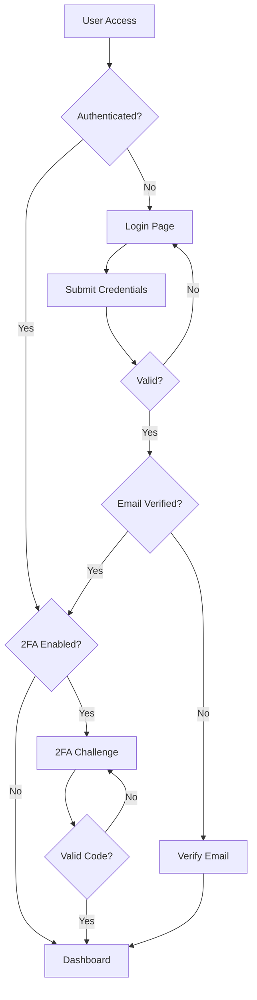

# Authentication

> 📹 **Video Placeholder**: Complete authentication workflow in Aura CMS including registration, login, 2FA setup, and team invitations

Aura CMS provides a comprehensive authentication system built on Laravel Fortify, enhanced with team support, two-factor authentication, and flexible role-based access control. The system seamlessly integrates with your application while providing enterprise-grade security features.

## Table of Contents

- [Introduction](#introduction)
- [Authentication Flow](#authentication-flow)
- [Configuration](#configuration)
- [Registration & Login](#registration--login)
- [Password Management](#password-management)
- [Two-Factor Authentication](#two-factor-authentication)
- [Email Verification](#email-verification)
- [Team Authentication](#team-authentication)
- [Session Management](#session-management)
- [API Authentication](#api-authentication)
- [Customization](#customization)
- [Security Best Practices](#security-best-practices)
- [Troubleshooting](#troubleshooting)

## Introduction

The authentication system in Aura CMS extends Laravel's authentication with:

- **Multi-tenancy Support**: Team-based authentication with invitations
- **Enhanced Security**: Built-in 2FA, session management, and device tracking
- **Flexible Registration**: Open registration, invitation-only, or disabled
- **Custom User Fields**: Extend user profiles with custom fields
- **Role Integration**: Seamless integration with the permission system
- **Event-Driven**: Hooks for custom authentication logic

## Authentication Flow

Understanding the authentication flow helps you customize and extend the system:



### Authentication States

| State | Description | Access Level |
|-------|-------------|--------------|
| Guest | Not authenticated | Public pages only |
| Authenticated | Logged in, no 2FA | Basic access |
| Verified | Email verified | Full user access |
| 2FA Authenticated | Passed 2FA challenge | Enhanced security access |
| Team Member | Authenticated with team | Team resources |

### Authentication Events

```php
// Available authentication events
use Aura\Base\Events\LoggedIn;
use Illuminate\Auth\Events\Registered;
use Illuminate\Auth\Events\Verified;
use Illuminate\Auth\Events\PasswordReset;

// Listen to events in EventServiceProvider
protected $listen = [
    LoggedIn::class => [
        SendWelcomeNotification::class,
        LogUserActivity::class,
    ],
    Registered::class => [
        CreateDefaultSettings::class,
        AssignDefaultRole::class,
    ],
];
```

## Configuration

Authentication behavior is controlled through `config/aura.php`:

```php
return [
    'auth' => [
        // Registration settings
        'registration' => env('AURA_REGISTRATION', true),
        'registration_teams' => true,  // Create team on registration
        'require_email_verification' => true,
        
        // Authentication behavior
        'redirect' => '/admin',  // Post-login redirect
        'logout_redirect' => '/',  // Post-logout redirect
        'password_timeout' => 10800,  // Password confirmation timeout (seconds)
        
        // Security features
        '2fa' => true,  // Enable two-factor authentication
        '2fa_required' => false,  // Force 2FA for all users
        'session_lifetime' => 120,  // Session lifetime in minutes
        
        // Team features
        'user_invitations' => true,  // Enable team invitations
        'create_teams' => true,  // Allow users to create teams
        'max_teams_per_user' => null,  // Limit teams per user
    ],
];
```

### Environment Variables

```env
# Authentication
AURA_REGISTRATION=true
AURA_REQUIRE_EMAIL_VERIFICATION=true
AURA_2FA_REQUIRED=false

# Session
SESSION_LIFETIME=120
SESSION_SECURE_COOKIE=true

# Password
PASSWORD_RESET_EXPIRE=60
```

### Fortify Configuration

Aura CMS uses Laravel Fortify with custom configuration:

```php
// config/fortify.php
return [
    'guard' => 'web',
    'middleware' => ['web'],
    'auth_middleware' => 'auth',
    'passwords' => 'users',
    'username' => 'email',
    'email' => 'email',
    'views' => true,  // Aura provides views
    'home' => '/admin',
    'prefix' => '',
    'domain' => null,
    'lowercase_usernames' => false,
    'limiters' => [
        'login' => 'login',
        'two-factor' => 'two-factor',
    ],
    'paths' => [
        'login' => 'login',
        'logout' => 'logout',
        'register' => 'register',
        'password' => [
            'request' => 'forgot-password',
            'reset' => 'reset-password',
            'email' => 'forgot-password',
            'update' => 'user/password',
        ],
        'verification' => [
            'notice' => 'email/verify',
            'verify' => 'email/verify/{id}/{hash}',
            'send' => 'email/verification-notification',
        ],
    ],
    'features' => [
        Features::registration(),
        Features::resetPasswords(),
        Features::emailVerification(),
        Features::updateProfileInformation(),
        Features::updatePasswords(),
        Features::twoFactorAuthentication([
            'confirm' => true,
            'confirmPassword' => true,
        ]),
    ],
];
```

## Registration & Login

### User Registration

#### Basic Registration

```php
// Enable registration in config/aura.php
'registration' => true,

// Registration creates a team by default
'registration_teams' => true,
```

#### Registration Process

1. **User fills registration form**
   ```blade
   <form method="POST" action="{{ route('aura.register') }}">
       @csrf
       <x-aura::input.text name="name" required />
       <x-aura::input.email name="email" required />
       <x-aura::input.password name="password" required />
       <x-aura::input.password name="password_confirmation" required />
       
       @if(config('aura.teams'))
           <x-aura::input.text name="team_name" label="Organization Name" />
       @endif
   </form>
   ```

2. **User account created**
   ```php
   // In RegistrationController
   $user = User::create([
       'name' => $request->name,
       'email' => $request->email,
       'password' => Hash::make($request->password),
   ]);
   
   // Create team if enabled
   if (config('aura.teams')) {
       $team = $user->ownedTeams()->create([
           'name' => $request->team_name,
           'personal_team' => true,
       ]);
       
       $user->current_team_id = $team->id;
       $user->save();
   }
   ```

3. **Default role assignment**
   ```php
   // Automatically assign default role
   $defaultRole = Role::where('slug', 'member')->first();
   $user->roles()->attach($defaultRole);
   ```

4. **Email verification sent** (if enabled)

#### Custom Registration Logic

```php
use Laravel\Fortify\Fortify;

// In FortifyServiceProvider
Fortify::createUsersUsing(CreateNewUser::class);

// Custom user creation class
class CreateNewUser implements CreatesNewUsers
{
    public function create(array $input)
    {
        Validator::make($input, [
            'name' => ['required', 'string', 'max:255'],
            'email' => ['required', 'email', 'unique:users'],
            'password' => ['required', 'string', 'min:8', 'confirmed'],
            'company' => ['required', 'string', 'max:100'],
            'phone' => ['nullable', 'string', 'max:20'],
        ])->validate();
        
        return DB::transaction(function () use ($input) {
            $user = User::create([
                'name' => $input['name'],
                'email' => $input['email'],
                'password' => Hash::make($input['password']),
                'fields' => [
                    'company' => $input['company'],
                    'phone' => $input['phone'],
                ],
            ]);
            
            // Custom onboarding logic
            $this->createUserSettings($user);
            $this->assignTrialPlan($user);
            $this->sendWelcomeEmail($user);
            
            return $user;
        });
    }
}
```

### Login System

#### Standard Login

```php
// Login route
Route::get('/login', [AuthController::class, 'showLogin'])
    ->name('aura.login');

Route::post('/login', [AuthController::class, 'login']);
```

#### Login Features

- **Rate Limiting**: Prevents brute force attacks
  ```php
  // After 5 failed attempts, lockout for 1 minute
  RateLimiter::for('login', function (Request $request) {
      return Limit::perMinute(5)->by($request->email.$request->ip());
  });
  ```

- **Remember Me**: Long-lived authentication
  ```php
  Auth::attempt([
      'email' => $request->email,
      'password' => $request->password,
  ], $request->remember);
  ```

- **Custom Guards**: Support for different user types
  ```php
  // Admin guard
  Auth::guard('admin')->attempt($credentials);
  ```

#### Login Customization

```php
// Custom login view
Fortify::loginView(function () {
    return view('auth.custom-login', [
        'canResetPassword' => Route::has('password.request'),
        'canRegister' => Route::has('register'),
    ]);
});

// Custom authentication logic
Fortify::authenticateUsing(function (Request $request) {
    $user = User::where('email', $request->email)
        ->orWhere('username', $request->email)
        ->first();
    
    if ($user && 
        Hash::check($request->password, $user->password) &&
        $user->is_active) {
        return $user;
    }
});
```

#### Post-Login Actions

```php
class LoginController
{
    protected function authenticated(Request $request, $user)
    {
        // Log user activity
        activity()
            ->causedBy($user)
            ->log('User logged in');
        
        // Update last login
        $user->update([
            'last_login_at' => now(),
            'last_login_ip' => $request->ip(),
        ]);
        
        // Redirect based on role
        if ($user->hasRole('admin')) {
            return redirect()->route('admin.dashboard');
        }
        
        return redirect()->route('dashboard');
    }
}
```

## Password Management

### Password Reset Flow

1. **Request Reset Link**
   ```blade
   <form method="POST" action="{{ route('password.email') }}">
       @csrf
       <x-aura::input.email 
           name="email" 
           required 
           placeholder="Enter your email address"
       />
       <x-aura::button type="submit">
           Send Password Reset Link
       </x-aura::button>
   </form>
   ```

2. **Email Notification**
   ```php
   // Custom reset notification
   class User extends Authenticatable
   {
       public function sendPasswordResetNotification($token)
       {
           $this->notify(new CustomResetPasswordNotification($token));
       }
   }
   ```

3. **Reset Password Form**
   ```blade
   <form method="POST" action="{{ route('password.update') }}">
       @csrf
       <input type="hidden" name="token" value="{{ $token }}">
       <x-aura::input.email name="email" value="{{ $email }}" readonly />
       <x-aura::input.password name="password" required />
       <x-aura::input.password name="password_confirmation" required />
   </form>
   ```

### Password Requirements

```php
// Custom password rules
Password::defaults(function () {
    $rule = Password::min(8);
    
    return $this->app->isProduction()
        ? $rule->letters()
               ->mixedCase()
               ->numbers()
               ->symbols()
               ->uncompromised()
        : $rule;
});

// In validation
'password' => ['required', Password::defaults()],
```

### Password Confirmation

For sensitive operations:

```php
Route::post('/settings/delete-account', function () {
    // User must confirm password
})->middleware(['auth', 'password.confirm']);

// Custom timeout
Route::post('/admin/settings', function () {
    // ...
})->middleware(['auth', 'password.confirm:admin.password.confirm,3600']);
```

## Two-Factor Authentication

### 2FA Configuration

```php
// Enable 2FA globally
'2fa' => true,

// Require 2FA for all users
'2fa_required' => false,

// Require 2FA for specific roles
public function boot()
{
    Gate::define('require-2fa', function ($user) {
        return $user->hasRole(['admin', 'manager']);
    });
}
```

### Enabling 2FA

#### User-Initiated Setup

```php
// In profile component
public function enableTwoFactorAuthentication()
{
    $this->user->forceFill([
        'two_factor_secret' => encrypt(app(TwoFactorAuthenticationProvider::class)->generateSecretKey()),
        'two_factor_recovery_codes' => encrypt(json_encode(Collection::times(8, function () {
            return RecoveryCode::generate();
        })->all())),
    ])->save();
    
    $this->showQrCode = true;
}
```

#### Setup Interface

```blade
{{-- Two-factor authentication setup --}}
<div x-data="{ showQr: false, showCodes: false }">
    @if(!$user->two_factor_secret)
        <x-aura::button @click="showQr = true" wire:click="enableTwoFactorAuthentication">
            Enable Two-Factor Authentication
        </x-aura::button>
    @else
        <div class="text-sm text-green-600">
            ✓ Two-factor authentication is enabled
        </div>
    @endif
    
    {{-- QR Code Modal --}}
    <div x-show="showQr" class="fixed inset-0 z-50">
        <div class="bg-white p-6 rounded-lg">
            <h3>Scan this QR code with your authenticator app</h3>
            {!! $this->user->twoFactorQrCodeSvg() !!}
            
            <div class="mt-4">
                <p>Or enter this code manually:</p>
                <code>{{ decrypt($this->user->two_factor_secret) }}</code>
            </div>
            
            <form wire:submit.prevent="confirmTwoFactorAuthentication">
                <x-aura::input.text 
                    wire:model.defer="code"
                    placeholder="Enter code from app"
                />
                <x-aura::button type="submit">Confirm</x-aura::button>
            </form>
        </div>
    </div>
</div>
```

### 2FA Login Challenge

```php
// Two-factor challenge view
Fortify::twoFactorChallengeView(function () {
    return view('auth.two-factor-challenge', [
        'hasRecoveryCode' => session('recovery_code_entered', false),
    ]);
});
```

```blade
{{-- Two-factor challenge form --}}
<form method="POST" action="{{ route('two-factor.login') }}">
    @csrf
    
    @if(!$hasRecoveryCode)
        <div>
            <label>Authentication Code</label>
            <x-aura::input.text 
                name="code" 
                inputmode="numeric"
                autofocus
                autocomplete="one-time-code"
            />
        </div>
        
        <button type="button" @click="useRecoveryCode = true">
            Use a recovery code
        </button>
    @else
        <div>
            <label>Recovery Code</label>
            <x-aura::input.text 
                name="recovery_code"
                autocomplete="off"
            />
        </div>
    @endif
    
    <x-aura::button type="submit">
        Log in
    </x-aura::button>
</form>
```

### Recovery Codes

```php
// Generate new recovery codes
public function regenerateRecoveryCodes()
{
    $this->user->forceFill([
        'two_factor_recovery_codes' => encrypt(json_encode(
            Collection::times(8, fn () => RecoveryCode::generate())->all()
        )),
    ])->save();
    
    $this->showRecoveryCodes = true;
}

// Display recovery codes
@foreach (json_decode(decrypt($user->two_factor_recovery_codes), true) as $code)
    <div class="font-mono text-sm">{{ $code }}</div>
@endforeach
```

### Enforcing 2FA

```php
// Middleware to enforce 2FA
class EnsureTwoFactorEnabled
{
    public function handle($request, Closure $next)
    {
        $user = $request->user();
        
        if ($user && 
            Gate::allows('require-2fa', $user) && 
            !$user->hasEnabledTwoFactorAuthentication()) {
            
            return redirect()->route('profile.show')
                ->with('error', 'Two-factor authentication is required for your account.');
        }
        
        return $next($request);
    }
}

// Apply to routes
Route::middleware(['auth', 'ensure-2fa'])->group(function () {
    Route::get('/admin', [AdminController::class, 'index']);
});
```

## Email Verification

### Configuration

```php
// Enable email verification
'require_email_verification' => true,

// Or conditionally
public function boot()
{
    Fortify::verifyEmailUsing(function ($user) {
        return $user->hasRole('premium');
    });
}
```

### Verification Process

1. **Send Verification Email**
   ```php
   // Automatically sent on registration
   event(new Registered($user));
   
   // Or manually
   $user->sendEmailVerificationNotification();
   ```

2. **Custom Verification Email**
   ```php
   class User extends Authenticatable implements MustVerifyEmail
   {
       public function sendEmailVerificationNotification()
       {
           $this->notify(new CustomVerifyEmail);
       }
   }
   ```

3. **Verification Routes**
   ```php
   // Protected routes
   Route::middleware(['auth', 'verified'])->group(function () {
       Route::get('/dashboard', [DashboardController::class, 'index']);
   });
   ```

### Custom Verification Logic

```php
// Custom verification with additional checks
Fortify::verifyEmailUsing(function ($user, $hash) {
    if (!hash_equals((string) $hash, sha1($user->getEmailForVerification()))) {
        return false;
    }
    
    // Additional verification logic
    if ($user->verification_token !== request('token')) {
        return false;
    }
    
    $user->markEmailAsVerified();
    
    // Post-verification actions
    $user->assignRole('verified');
    $user->grantTrialAccess();
    
    return true;
});
```

## Team Authentication

### Team-Based Registration

When teams are enabled, registration creates a personal team:

```php
// Registration with team
public function register(Request $request)
{
    $user = User::create([
        'name' => $request->name,
        'email' => $request->email,
        'password' => Hash::make($request->password),
    ]);
    
    // Create personal team
    $team = $user->ownedTeams()->create([
        'name' => $request->team_name ?? $user->name . "'s Team",
        'personal_team' => true,
    ]);
    
    // Set as current team
    $user->current_team_id = $team->id;
    $user->save();
    
    // Assign team role
    $user->teams()->updateExistingPivot($team->id, [
        'role' => 'owner',
    ]);
    
    return $user;
}
```

### Team Invitations

#### Sending Invitations

```php
// In team settings
public function inviteTeamMember()
{
    $this->validate([
        'email' => ['required', 'email'],
        'role' => ['required', Rule::in(['admin', 'editor', 'member'])],
    ]);
    
    $invitation = $this->team->teamInvitations()->create([
        'email' => $this->email,
        'role' => $this->role,
        'expires_at' => now()->addDays(7),
    ]);
    
    Mail::to($this->email)->send(new TeamInvitationMail($invitation));
}
```

#### Invitation Email

```php
// Custom invitation email
class TeamInvitationMail extends Mailable
{
    public function build()
    {
        $acceptUrl = URL::signedRoute('team-invitations.accept', [
            'invitation' => $this->invitation,
        ]);
        
        return $this->subject("You're invited to join {$this->invitation->team->name}")
            ->markdown('emails.team-invitation', [
                'acceptUrl' => $acceptUrl,
                'team' => $this->invitation->team,
            ]);
    }
}
```

#### Accepting Invitations

```php
// Routes
Route::get('/invitations/{invitation}/accept', [TeamInvitationController::class, 'show'])
    ->middleware(['signed'])
    ->name('team-invitations.accept');

Route::post('/invitations/{invitation}/accept', [TeamInvitationController::class, 'accept'])
    ->middleware(['signed', 'auth']);

// Controller
public function accept(TeamInvitation $invitation)
{
    // Validate invitation
    abort_unless($invitation->email === auth()->user()->email, 403);
    abort_if($invitation->hasExpired(), 403);
    
    // Add user to team
    $invitation->team->users()->attach(auth()->user(), [
        'role' => $invitation->role,
    ]);
    
    // Clean up
    $invitation->delete();
    
    // Switch to new team
    auth()->user()->switchTeam($invitation->team);
    
    return redirect()->route('dashboard')
        ->with('success', "You've joined {$invitation->team->name}!");
}
```

### Team Switching

```php
// Switch team
public function switchTeam(Team $team)
{
    abort_unless(auth()->user()->belongsToTeam($team), 403);
    
    auth()->user()->update([
        'current_team_id' => $team->id,
    ]);
    
    return redirect()->route('dashboard');
}

// Team switcher component
<x-aura::dropdown>
    <x-slot name="trigger">
        {{ auth()->user()->currentTeam->name }}
    </x-slot>
    
    @foreach(auth()->user()->allTeams() as $team)
        <x-aura::dropdown.item 
            :href="route('teams.switch', $team)"
            :active="$team->id === auth()->user()->current_team_id">
            {{ $team->name }}
        </x-aura::dropdown.item>
    @endforeach
    
    <x-aura::dropdown.divider />
    
    <x-aura::dropdown.item :href="route('teams.create')">
        Create New Team
    </x-aura::dropdown.item>
</x-aura::dropdown>
```

## Session Management

### Session Configuration

```php
// config/session.php
return [
    'lifetime' => env('SESSION_LIFETIME', 120),
    'expire_on_close' => false,
    'encrypt' => true,
    'secure' => env('SESSION_SECURE_COOKIE', true),
    'same_site' => 'lax',
];
```

### Browser Sessions

Manage active sessions across devices:

```php
// Get all sessions
public function sessions()
{
    return collect(
        DB::table('sessions')
            ->where('user_id', auth()->id())
            ->orderBy('last_activity', 'desc')
            ->get()
    )->map(function ($session) {
        return (object) [
            'agent' => $session->user_agent,
            'ip_address' => $session->ip_address,
            'is_current' => $session->id === request()->session()->getId(),
            'last_active' => Carbon::createFromTimestamp($session->last_activity),
        ];
    });
}

// Logout other devices
public function logoutOtherBrowserSessions()
{
    DB::table('sessions')
        ->where('user_id', auth()->id())
        ->where('id', '!=', request()->session()->getId())
        ->delete();
}
```

## API Authentication

### Token Authentication

```php
// Generate API token
$token = $user->createToken('api-token', ['read', 'write']);

// Use token
curl -H "Authorization: Bearer {$token->plainTextToken}" \
     https://app.com/api/user

// Revoke tokens
$user->tokens()->delete();
$user->tokens()->where('name', 'api-token')->delete();
```

### API Guard Configuration

```php
// config/auth.php
'guards' => [
    'api' => [
        'driver' => 'sanctum',
        'provider' => 'users',
    ],
],

// Protect API routes
Route::middleware('auth:sanctum')->group(function () {
    Route::get('/api/user', function (Request $request) {
        return $request->user();
    });
});
```

## Customization

### Custom Views

Publish and customize authentication views:

```bash
php artisan vendor:publish --tag=aura-auth-views
```

Views structure:
```
resources/views/vendor/aura/auth/
├── login.blade.php
├── register.blade.php
├── verify-email.blade.php
├── forgot-password.blade.php
├── reset-password.blade.php
├── confirm-password.blade.php
└── two-factor-challenge.blade.php
```

### Custom Authentication Logic

```php
use Laravel\Fortify\Fortify;

class FortifyServiceProvider extends ServiceProvider
{
    public function boot()
    {
        // Custom authentication
        Fortify::authenticateUsing(function ($request) {
            $user = User::where('email', $request->email)
                ->orWhere('username', $request->email)
                ->first();
            
            if ($user && Hash::check($request->password, $user->password)) {
                return $user;
            }
        });
        
        // Custom registration
        Fortify::createUsersUsing(CreateNewUser::class);
        
        // Custom password reset
        Fortify::resetUserPasswordsUsing(ResetUserPassword::class);
        
        // Custom profile update
        Fortify::updateUserProfileInformationUsing(UpdateUserProfileInformation::class);
    }
}
```

### Authentication Events

```php
// Listen to authentication events
protected $listen = [
    // Login events
    'Illuminate\Auth\Events\Login' => [
        'App\Listeners\LogSuccessfulLogin',
        'App\Listeners\UpdateLastLoginTimestamp',
    ],
    
    // Registration events
    'Illuminate\Auth\Events\Registered' => [
        'App\Listeners\SendWelcomeEmail',
        'App\Listeners\CreateUserSettings',
    ],
    
    // Logout events
    'Illuminate\Auth\Events\Logout' => [
        'App\Listeners\LogUserLogout',
    ],
    
    // Failed login
    'Illuminate\Auth\Events\Failed' => [
        'App\Listeners\LogFailedLogin',
    ],
];
```

## Security Best Practices

### 1. Strong Password Policy

```php
use Illuminate\Validation\Rules\Password;

Password::defaults(function () {
    return Password::min(8)
        ->letters()
        ->mixedCase()
        ->numbers()
        ->symbols()
        ->uncompromised();
});
```

### 2. Session Security

```php
// Force HTTPS for authentication
if (app()->environment('production')) {
    URL::forceScheme('https');
}

// Session fixation protection
protected function authenticated(Request $request, $user)
{
    $request->session()->regenerate();
}
```

### 3. Rate Limiting

```php
// Custom rate limits
RateLimiter::for('login', function (Request $request) {
    $key = Str::lower($request->input('email')).'|'.$request->ip();
    $max = 5; // attempts
    $decay = 60; // seconds
    
    if (RateLimiter::tooManyAttempts($key, $max)) {
        event(new Lockout($request));
        return back()->with('error', 'Too many login attempts.');
    }
    
    RateLimiter::hit($key, $decay);
});
```

### 4. Account Security

```php
// Notify users of security events
class User extends Authenticatable
{
    protected static function booted()
    {
        static::updated(function ($user) {
            if ($user->isDirty('email')) {
                $user->notify(new EmailChangedNotification($user->getOriginal('email')));
            }
            
            if ($user->isDirty('password')) {
                $user->notify(new PasswordChangedNotification);
            }
        });
    }
}
```

## Troubleshooting

### Common Issues

**Login redirect loop:**
```php
// Check middleware order
protected $middlewarePriority = [
    \Illuminate\Session\Middleware\StartSession::class,
    \Illuminate\View\Middleware\ShareErrorsFromSession::class,
    \Illuminate\Contracts\Auth\Middleware\AuthenticatesRequests::class,
    // ...
];
```

**Session expiring too quickly:**
```php
// Increase session lifetime
SESSION_LIFETIME=120 # minutes

// Or for specific routes
Route::middleware(['auth', 'session.lifetime:480'])->group(function () {
    // Long-running tasks
});
```

**2FA not working:**
```php
// Ensure encryption key is set
php artisan key:generate

// Clear config cache
php artisan config:clear
```

**Email verification issues:**
```php
// Check mail configuration
MAIL_MAILER=smtp
MAIL_FROM_ADDRESS=noreply@example.com

// Test mail
php artisan tinker
>>> Mail::raw('Test', fn($m) => $m->to('test@example.com'));
```

### Debug Authentication

```php
// Log authentication attempts
Event::listen(Login::class, function ($event) {
    logger()->info('User logged in', [
        'user' => $event->user->id,
        'ip' => request()->ip(),
        'user_agent' => request()->userAgent(),
    ]);
});

// Debug guards
dd(auth()->guard()); // Current guard
dd(config('auth.guards')); // All guards
dd(auth()->user()); // Current user
```

## Summary

Aura CMS's authentication system provides:

- **Flexible Registration**: Open, closed, or invitation-only
- **Enhanced Security**: 2FA, email verification, secure sessions
- **Team Support**: Multi-tenancy with team switching
- **Easy Customization**: Override any part of the auth flow
- **API Ready**: Built-in token authentication
- **Event-Driven**: Hook into any authentication event

The system is designed to be secure by default while remaining flexible enough for any authentication requirement.

> 📹 **Video Placeholder**: Implementing custom authentication flows and security features in Aura CMS

For permission management, see the [Roles & Permissions Documentation](roles-permissions.md).
