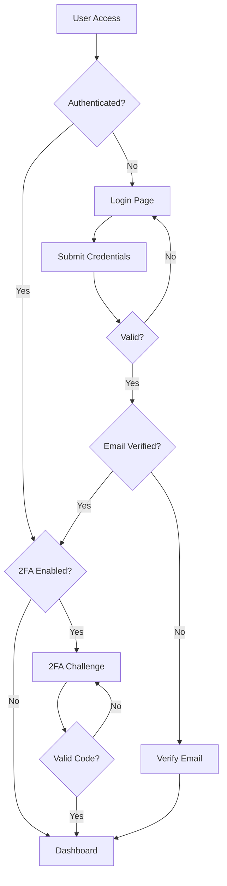

# Authentication

> 📹 **Video Placeholder**: Complete authentication workflow in Aura CMS including registration, login, 2FA setup, and team invitations

Aura CMS provides a comprehensive authentication system built on Laravel Fortify, enhanced with team support, two-factor authentication, and flexible role-based access control. The system seamlessly integrates with your application while providing enterprise-grade security features.

## Table of Contents

- [Introduction](#introduction)
- [Authentication Flow](#authentication-flow)
- [Configuration](#configuration)
- [Registration & Login](#registration--login)
- [Password Management](#password-management)
- [Two-Factor Authentication](#two-factor-authentication)
- [Email Verification](#email-verification)
- [Team Authentication](#team-authentication)
- [Middleware](#middleware)
- [Session Management](#session-management)
- [API Authentication](#api-authentication)
- [Customization](#customization)
- [Security Best Practices](#security-best-practices)
- [Troubleshooting](#troubleshooting)

## Introduction

The authentication system in Aura CMS extends Laravel's authentication with:

- **Multi-tenancy Support**: Team-based authentication with invitations
- **Enhanced Security**: Built-in 2FA, session management, and device tracking
- **Flexible Registration**: Open registration, invitation-only, or disabled
- **Custom User Fields**: Extend user profiles with custom fields
- **Role Integration**: Seamless integration with the permission system
- **Event-Driven**: Hooks for custom authentication logic

## Authentication Flow

Understanding the authentication flow helps you customize and extend the system:



### Authentication States

| State | Description | Access Level |
|-------|-------------|--------------|
| Guest | Not authenticated | Public pages only |
| Authenticated | Logged in, no 2FA | Basic access |
| Verified | Email verified | Full user access |
| 2FA Authenticated | Passed 2FA challenge | Enhanced security access |
| Team Member | Authenticated with team | Team resources |

### Authentication Events

```php
// Available authentication events
use Aura\Base\Events\LoggedIn;
use Illuminate\Auth\Events\Registered;
use Illuminate\Auth\Events\Verified;
use Illuminate\Auth\Events\PasswordReset;

// Listen to events in EventServiceProvider
protected $listen = [
    LoggedIn::class => [
        SendWelcomeNotification::class,
        LogUserActivity::class,
    ],
    Registered::class => [
        CreateDefaultSettings::class,
        AssignDefaultRole::class,
    ],
];
```

## Configuration

Authentication behavior is controlled through `config/aura.php`:

```php
return [
    'auth' => [
        // Registration settings
        'registration' => env('AURA_REGISTRATION', true),  // Enable/disable public registration
        
        // Authentication behavior
        'redirect' => '/admin',  // Post-login redirect path
        
        // Security features
        '2fa' => true,  // Enable two-factor authentication
        
        // Team features
        'user_invitations' => true,  // Enable team invitations
        'create_teams' => true,  // Allow users to create new teams
    ],
];
```

Teams are enabled separately via the `teams` config option:

```php
return [
    'teams' => env('AURA_TEAMS', true),  // Enable multi-tenancy
];
```

### Environment Variables

```env
# Authentication
AURA_REGISTRATION=true
AURA_TEAMS=true

# Session (standard Laravel config)
SESSION_LIFETIME=120
SESSION_SECURE_COOKIE=true

# Password Reset
PASSWORD_RESET_EXPIRE=60
```

### Fortify Configuration

Aura CMS uses Laravel Fortify with custom configuration. Note that Aura provides its own authentication routes and views, so Fortify's view registration is disabled:

```php
// config/fortify.php
return [
    'guard' => 'web',
    'middleware' => ['web'],
    'passwords' => 'users',
    'username' => 'email',
    'email' => 'email',
    'views' => false,  // Aura provides its own auth routes/views
    'home' => '/home',
    'prefix' => '',
    'domain' => null,
    'lowercase_usernames' => true,  // Emails are lowercased before saving
    'limiters' => [
        'login' => 'login',
        'two-factor' => 'two-factor',
    ],
    'features' => [
        Features::registration(),
        Features::resetPasswords(),
        // Features::emailVerification(),  // Enable if needed
        Features::updateProfileInformation(),
        Features::updatePasswords(),
        Features::twoFactorAuthentication([
            'confirm' => true,
            'confirmPassword' => true,
        ]),
    ],
];
```

Aura CMS defines its own authentication routes in `routes/auth.php`, which provides:
- Login/logout (`/login`, `/logout`)
- Registration (`/register`) - when enabled
- Password reset (`/forgot-password`, `/reset-password/{token}`)
- Email verification (`/email/verify`, `/email/verify/{id}/{hash}`)
- Two-factor authentication (`/two-factor-challenge`, `/user/two-factor-authentication`)
- Team invitations (`/team-invitations/{invitation}`)

## Registration & Login

### User Registration

#### Basic Registration

```php
// Enable registration in config/aura.php
'auth' => [
    'registration' => true,  // Allow public registration
],

// With teams enabled, registration automatically creates a team
'teams' => true,
```

#### Registration Process

1. **User fills registration form**
   ```blade
   <form method="POST" action="{{ route('aura.register.post') }}">
       @csrf
       <x-aura::input.text name="name" required />
       <x-aura::input.email name="email" required />
       <x-aura::input.password name="password" required />
       <x-aura::input.password name="password_confirmation" required />
       
       @if(config('aura.teams'))
           <x-aura::input.text name="team" label="Organization Name" />
       @endif
   </form>
   ```

2. **User account created**
   ```php
   // In RegisteredUserController
   // With teams enabled:
   $user = app(config('aura.resources.user'))::create([
       'name' => $request->name,
       'email' => $request->email,
       'password' => Hash::make($request->password),
   ]);

   $team = app(config('aura.resources.team'))::create([
       'name' => $request->team,
       'user_id' => $user->id,
   ]);

   $user->current_team_id = $team->id;
   $user->save();
   
   // Without teams:
   $user = app(config('aura.resources.user'))::create([
       'name' => $request->name,
       'email' => $request->email,
       'password' => Hash::make($request->password),
   ]);
   ```

3. **Default role assignment**
   ```php
   // With teams: assigns first role from the team
   $role = $team->roles->first();
   $user->update(['roles' => [$role->id]]);
   
   // Without teams: assigns 'user' role
   $role = Role::where('slug', 'user')->firstOrFail();
   $user->update(['roles' => [$role->id]]);
   ```

4. **Email verification sent** (if enabled)

#### Custom Registration Logic

```php
use Laravel\Fortify\Fortify;

// In FortifyServiceProvider
Fortify::createUsersUsing(CreateNewUser::class);

// Custom user creation class
class CreateNewUser implements CreatesNewUsers
{
    public function create(array $input)
    {
        Validator::make($input, [
            'name' => ['required', 'string', 'max:255'],
            'email' => ['required', 'email', 'unique:users'],
            'password' => ['required', 'string', 'min:8', 'confirmed'],
            'company' => ['required', 'string', 'max:100'],
            'phone' => ['nullable', 'string', 'max:20'],
        ])->validate();
        
        return DB::transaction(function () use ($input) {
            $user = User::create([
                'name' => $input['name'],
                'email' => $input['email'],
                'password' => Hash::make($input['password']),
                'fields' => [
                    'company' => $input['company'],
                    'phone' => $input['phone'],
                ],
            ]);
            
            // Custom onboarding logic
            $this->createUserSettings($user);
            $this->assignTrialPlan($user);
            $this->sendWelcomeEmail($user);
            
            return $user;
        });
    }
}
```

### Login System

#### Standard Login

```php
// Login routes (defined in routes/auth.php)
Route::get('login', [AuthenticatedSessionController::class, 'create'])
    ->name('aura.login');

Route::post('login', [AuthenticatedSessionController::class, 'store']);
```

#### Login Features

- **Rate Limiting**: Prevents brute force attacks (5 attempts per email+IP combination)
  ```php
  // In LoginRequest class
  public function ensureIsNotRateLimited()
  {
      if (! RateLimiter::tooManyAttempts($this->throttleKey(), 5)) {
          return;
      }

      event(new Lockout($this));
      
      $seconds = RateLimiter::availableIn($this->throttleKey());
      throw ValidationException::withMessages([
          'email' => trans('auth.throttle', [
              'seconds' => $seconds,
              'minutes' => ceil($seconds / 60),
          ]),
      ]);
  }
  
  public function throttleKey()
  {
      return Str::transliterate(Str::lower($this->input('email')).'|'.$this->ip());
  }
  ```

- **Remember Me**: Long-lived authentication
  ```php
  Auth::attempt([
      'email' => $request->email,
      'password' => $request->password,
  ], $request->remember);
  ```

- **Custom Guards**: Support for different user types
  ```php
  // Admin guard
  Auth::guard('admin')->attempt($credentials);
  ```

#### Login Customization

```php
// Custom login view
Fortify::loginView(function () {
    return view('auth.custom-login', [
        'canResetPassword' => Route::has('password.request'),
        'canRegister' => Route::has('register'),
    ]);
});

// Custom authentication logic
Fortify::authenticateUsing(function (Request $request) {
    $user = User::where('email', $request->email)
        ->orWhere('username', $request->email)
        ->first();
    
    if ($user && 
        Hash::check($request->password, $user->password) &&
        $user->is_active) {
        return $user;
    }
});
```

#### Post-Login Actions

Aura CMS fires a `LoggedIn` event after successful authentication:

```php
use Aura\Base\Events\LoggedIn;

// In AuthenticatedSessionController::store()
event(new LoggedIn($request->user()));

// Listen to the event in your EventServiceProvider
protected $listen = [
    \Aura\Base\Events\LoggedIn::class => [
        \App\Listeners\LogSuccessfulLogin::class,
        \App\Listeners\UpdateLastLoginTimestamp::class,
    ],
];

// Example listener
class UpdateLastLoginTimestamp
{
    public function handle(LoggedIn $event)
    {
        $event->user->update([
            'last_login_at' => now(),
            'last_login_ip' => request()->ip(),
        ]);
    }
}
```

The post-login redirect is configured via `config('aura.auth.redirect')`, defaulting to `/admin`.

## Password Management

### Password Reset Flow

1. **Request Reset Link**
   ```blade
   <form method="POST" action="{{ route('password.email') }}">
       @csrf
       <x-aura::input.email 
           name="email" 
           required 
           placeholder="Enter your email address"
       />
       <x-aura::button type="submit">
           Send Password Reset Link
       </x-aura::button>
   </form>
   ```

2. **Email Notification**
   ```php
   // Custom reset notification
   class User extends Authenticatable
   {
       public function sendPasswordResetNotification($token)
       {
           $this->notify(new CustomResetPasswordNotification($token));
       }
   }
   ```

3. **Reset Password Form**
   ```blade
   <form method="POST" action="{{ route('password.update') }}">
       @csrf
       <input type="hidden" name="token" value="{{ $token }}">
       <x-aura::input.email name="email" value="{{ $email }}" readonly />
       <x-aura::input.password name="password" required />
       <x-aura::input.password name="password_confirmation" required />
   </form>
   ```

### Password Requirements

```php
// Custom password rules
Password::defaults(function () {
    $rule = Password::min(8);
    
    return $this->app->isProduction()
        ? $rule->letters()
               ->mixedCase()
               ->numbers()
               ->symbols()
               ->uncompromised()
        : $rule;
});

// In validation
'password' => ['required', Password::defaults()],
```

### Password Confirmation

For sensitive operations:

```php
Route::post('/settings/delete-account', function () {
    // User must confirm password
})->middleware(['auth', 'password.confirm']);

// Custom timeout
Route::post('/admin/settings', function () {
    // ...
})->middleware(['auth', 'password.confirm:admin.password.confirm,3600']);
```

## Two-Factor Authentication

### 2FA Configuration

```php
// Enable 2FA in config/aura.php
'auth' => [
    '2fa' => true,  // Enable two-factor authentication feature
],
```

### 2FA Routes

When 2FA is enabled, these routes are available:

| Route | Method | Name | Description |
|-------|--------|------|-------------|
| `/two-factor-challenge` | GET | `aura.two-factor.login` | 2FA challenge page |
| `/two-factor-challenge` | POST | - | Verify 2FA code |
| `/user/two-factor-authentication` | POST | `aura.two-factor.enable` | Enable 2FA |
| `/user/two-factor-authentication` | DELETE | `aura.two-factor.disable` | Disable 2FA |
| `/user/confirmed-two-factor-authentication` | POST | `aura.two-factor.confirm` | Confirm 2FA setup |
| `/user/two-factor-qr-code` | GET | `aura.two-factor.qr-code` | Get QR code |
| `/user/two-factor-secret-key` | GET | `aura.two-factor.secret-key` | Get secret key |
| `/user/two-factor-recovery-codes` | GET/POST | `aura.two-factor.recovery-codes` | View/regenerate codes |

All 2FA management routes require `auth:web` and `password.confirm` middleware.

### Enabling 2FA

Aura CMS provides a `TwoFactorAuthenticationForm` Livewire component (based on Laravel Jetstream) for managing 2FA.

#### User-Initiated Setup

```php
// In TwoFactorAuthenticationForm component
use Laravel\Fortify\Actions\EnableTwoFactorAuthentication;

public function enableTwoFactorAuthentication(EnableTwoFactorAuthentication $enable)
{
    $this->ensurePasswordIsConfirmed();  // Requires password confirmation
    
    $enable($this->user);  // Uses Fortify action
    
    $this->showingQrCode = true;
    $this->showingConfirmation = true;
}
```

#### Setup Interface

```blade
{{-- Two-factor authentication setup --}}
<div x-data="{ showQr: false, showCodes: false }">
    @if(!$user->two_factor_secret)
        <x-aura::button @click="showQr = true" wire:click="enableTwoFactorAuthentication">
            Enable Two-Factor Authentication
        </x-aura::button>
    @else
        <div class="text-sm text-green-600">
            ✓ Two-factor authentication is enabled
        </div>
    @endif
    
    {{-- QR Code Modal --}}
    <div x-show="showQr" class="fixed inset-0 z-50">
        <div class="bg-white p-6 rounded-lg">
            <h3>Scan this QR code with your authenticator app</h3>
            {!! $this->user->twoFactorQrCodeSvg() !!}
            
            <div class="mt-4">
                <p>Or enter this code manually:</p>
                <code>{{ decrypt($this->user->two_factor_secret) }}</code>
            </div>
            
            <form wire:submit.prevent="confirmTwoFactorAuthentication">
                <x-aura::input.text 
                    wire:model.defer="code"
                    placeholder="Enter code from app"
                />
                <x-aura::button type="submit">Confirm</x-aura::button>
            </form>
        </div>
    </div>
</div>
```

### 2FA Login Challenge

```php
// Two-factor challenge view
Fortify::twoFactorChallengeView(function () {
    return view('auth.two-factor-challenge', [
        'hasRecoveryCode' => session('recovery_code_entered', false),
    ]);
});
```

```blade
{{-- Two-factor challenge form --}}
<form method="POST" action="{{ route('two-factor.login') }}">
    @csrf
    
    @if(!$hasRecoveryCode)
        <div>
            <label>Authentication Code</label>
            <x-aura::input.text 
                name="code" 
                inputmode="numeric"
                autofocus
                autocomplete="one-time-code"
            />
        </div>
        
        <button type="button" @click="useRecoveryCode = true">
            Use a recovery code
        </button>
    @else
        <div>
            <label>Recovery Code</label>
            <x-aura::input.text 
                name="recovery_code"
                autocomplete="off"
            />
        </div>
    @endif
    
    <x-aura::button type="submit">
        Log in
    </x-aura::button>
</form>
```

### Recovery Codes

```php
use Laravel\Fortify\Actions\GenerateNewRecoveryCodes;

// Generate new recovery codes
public function regenerateRecoveryCodes(GenerateNewRecoveryCodes $generate)
{
    if (Features::optionEnabled(Features::twoFactorAuthentication(), 'confirmPassword')) {
        $this->ensurePasswordIsConfirmed();
    }

    $generate($this->user);

    $this->showingRecoveryCodes = true;
}

// Display recovery codes in Blade
@foreach (json_decode(decrypt($user->two_factor_recovery_codes), true) as $code)
    <div class="font-mono text-sm">{{ $code }}</div>
@endforeach
```

### Enforcing 2FA

```php
// Middleware to enforce 2FA
class EnsureTwoFactorEnabled
{
    public function handle($request, Closure $next)
    {
        $user = $request->user();
        
        if ($user && 
            Gate::allows('require-2fa', $user) && 
            !$user->hasEnabledTwoFactorAuthentication()) {
            
            return redirect()->route('profile.show')
                ->with('error', 'Two-factor authentication is required for your account.');
        }
        
        return $next($request);
    }
}

// Apply to routes
Route::middleware(['auth', 'ensure-2fa'])->group(function () {
    Route::get('/admin', [AdminController::class, 'index']);
});
```

## Email Verification

### Configuration

Email verification is controlled through Laravel Fortify's features. By default, it's commented out in Aura CMS:

```php
// In config/fortify.php - uncomment to enable
'features' => [
    // Features::emailVerification(),
],
```

To enable email verification, uncomment the line above. Users will then need to verify their email before accessing protected routes.

### Verification Process

1. **Send Verification Email**
   ```php
   // Automatically sent on registration
   event(new Registered($user));
   
   // Or manually
   $user->sendEmailVerificationNotification();
   ```

2. **Custom Verification Email**
   ```php
   class User extends Authenticatable implements MustVerifyEmail
   {
       public function sendEmailVerificationNotification()
       {
           $this->notify(new CustomVerifyEmail);
       }
   }
   ```

3. **Verification Routes**
   ```php
   // Protected routes
   Route::middleware(['auth', 'verified'])->group(function () {
       Route::get('/dashboard', [DashboardController::class, 'index']);
   });
   ```

### Custom Verification Logic

```php
// Custom verification with additional checks
Fortify::verifyEmailUsing(function ($user, $hash) {
    if (!hash_equals((string) $hash, sha1($user->getEmailForVerification()))) {
        return false;
    }
    
    // Additional verification logic
    if ($user->verification_token !== request('token')) {
        return false;
    }
    
    $user->markEmailAsVerified();
    
    // Post-verification actions
    $user->assignRole('verified');
    $user->grantTrialAccess();
    
    return true;
});
```

## Team Authentication

### Team-Based Registration

When teams are enabled, registration creates a personal team:

```php
// Registration with team
public function register(Request $request)
{
    $user = User::create([
        'name' => $request->name,
        'email' => $request->email,
        'password' => Hash::make($request->password),
    ]);
    
    // Create personal team
    $team = $user->ownedTeams()->create([
        'name' => $request->team_name ?? $user->name . "'s Team",
        'personal_team' => true,
    ]);
    
    // Set as current team
    $user->current_team_id = $team->id;
    $user->save();
    
    // Assign team role
    $user->teams()->updateExistingPivot($team->id, [
        'role' => 'owner',
    ]);
    
    return $user;
}
```

### Team Invitations

Aura CMS provides an `InviteUser` Livewire component for sending team invitations.

#### Sending Invitations

```php
// In InviteUser Livewire component
use Aura\Base\Mail\TeamInvitation;

public function save()
{
    $this->validate();  // Validates email and role

    $team = auth()->user()->currentTeam;

    $this->authorize('invite-users', $team);  // Check permission

    $invitation = $team->teamInvitations()->create([
        'email' => $this->form['fields']['email'],
        'role' => $this->form['fields']['role'],
    ]);

    Mail::to($email)->send(new TeamInvitation($invitation));
}
```

#### Invitation Email

```php
use Aura\Base\Mail\TeamInvitation;

// The TeamInvitation mailable sends an email with a signed URL
// that allows the invitee to join the team
```

#### Accepting Invitations

Invitations can be accepted via two routes:

**For existing users:**
```php
// Route defined in routes/auth.php
Route::get('/team-invitations/{invitation}', [TeamInvitationController::class, 'accept'])
    ->middleware(['signed'])
    ->name('aura.team-invitations.accept');
```

**For new users (registration with invitation):**
```php
// Routes for invited users who need to register
Route::get('register/{team}/{teamInvitation}', [InvitationRegisterUserController::class, 'create'])
    ->name('aura.invitation.register')
    ->middleware(['signed']);

Route::post('register/{team}/{teamInvitation}', [InvitationRegisterUserController::class, 'store'])
    ->middleware(['signed'])
    ->name('aura.invitation.register.post');
```

### Team Switching

Team switching is handled via a dedicated controller:

```php
// Route defined in routes/auth.php
Route::put('/current-team', [SwitchTeamController::class, 'update'])
    ->name('aura.current-team.update');

// Switch team via form
<form method="POST" action="{{ route('aura.current-team.update') }}">
    @csrf
    @method('PUT')
    <input type="hidden" name="team_id" value="{{ $team->id }}">
    <button type="submit">Switch to {{ $team->name }}</button>
</form>
```

## Middleware

Aura CMS provides several authentication middleware classes in `Aura\Base\Http\Middleware`:

### Authenticate

Redirects unauthenticated users to the login page:

```php
namespace Aura\Base\Http\Middleware;

use Illuminate\Auth\Middleware\Authenticate as Middleware;

class Authenticate extends Middleware
{
    protected function redirectTo($request)
    {
        if (! $request->expectsJson()) {
            return route('login');
        }
    }
}
```

### RedirectIfAuthenticated

Redirects authenticated users away from guest-only pages (login, register):

```php
namespace Aura\Base\Http\Middleware;

class RedirectIfAuthenticated
{
    public function handle(Request $request, Closure $next, ...$guards)
    {
        foreach ($guards as $guard) {
            if (Auth::guard($guard)->check()) {
                return redirect(config('aura.auth.redirect'));
            }
        }

        return $next($request);
    }
}
```

### Using Middleware

Apply middleware to routes:

```php
// Require authentication
Route::middleware('auth')->group(function () {
    Route::get('/dashboard', [DashboardController::class, 'index']);
});

// Guest only (redirects if authenticated)
Route::middleware('guest')->group(function () {
    Route::get('/login', [AuthController::class, 'showLogin']);
});

// Email verification required
Route::middleware(['auth', 'verified'])->group(function () {
    Route::get('/settings', [SettingsController::class, 'index']);
});
```

## Session Management

### Session Configuration

```php
// config/session.php
return [
    'lifetime' => env('SESSION_LIFETIME', 120),
    'expire_on_close' => false,
    'encrypt' => true,
    'secure' => env('SESSION_SECURE_COOKIE', true),
    'same_site' => 'lax',
];
```

### Browser Sessions

The Profile component includes session management functionality:

```php
// In Aura\Base\Livewire\Profile

public function logoutOtherBrowserSessions()
{
    if (request()->hasSession() && Schema::hasTable('sessions')) {
        DB::connection(config('session.connection'))
            ->table(config('session.table', 'sessions'))
            ->where('user_id', Auth::user()->getAuthIdentifier())
            ->where('id', '!=', request()->session()->getId())
            ->delete();
    }
}
```

This method is automatically called when a user changes their password, ensuring other devices are logged out for security.

## API Authentication

### Token Authentication

```php
// Generate API token
$token = $user->createToken('api-token', ['read', 'write']);

// Use token
curl -H "Authorization: Bearer {$token->plainTextToken}" \
     https://app.com/api/user

// Revoke tokens
$user->tokens()->delete();
$user->tokens()->where('name', 'api-token')->delete();
```

### API Guard Configuration

```php
// config/auth.php
'guards' => [
    'api' => [
        'driver' => 'sanctum',
        'provider' => 'users',
    ],
],

// Protect API routes
Route::middleware('auth:sanctum')->group(function () {
    Route::get('/api/user', function (Request $request) {
        return $request->user();
    });
});
```

## Customization

### Custom Views

Authentication views can be customized by publishing them or by configuring the view paths in `config/aura.php`:

```php
'views' => [
    'login-layout' => 'aura::layout.login',  // Layout for auth pages
    // ... other view configurations
],
```

The default authentication views are located in the package at:
```
resources/views/auth/
├── login.blade.php
├── register.blade.php
├── verify-email.blade.php
├── forgot-password.blade.php
├── reset-password.blade.php
├── confirm-password.blade.php
└── two-factor-challenge.blade.php
```

To customize, create your own views in your application's `resources/views/vendor/aura/auth/` directory.

### Custom Authentication Logic

```php
use Laravel\Fortify\Fortify;

class FortifyServiceProvider extends ServiceProvider
{
    public function boot()
    {
        // Custom authentication
        Fortify::authenticateUsing(function ($request) {
            $user = User::where('email', $request->email)
                ->orWhere('username', $request->email)
                ->first();
            
            if ($user && Hash::check($request->password, $user->password)) {
                return $user;
            }
        });
        
        // Custom registration
        Fortify::createUsersUsing(CreateNewUser::class);
        
        // Custom password reset
        Fortify::resetUserPasswordsUsing(ResetUserPassword::class);
        
        // Custom profile update
        Fortify::updateUserProfileInformationUsing(UpdateUserProfileInformation::class);
    }
}
```

### Authentication Events

```php
// Listen to authentication events
protected $listen = [
    // Login events
    'Illuminate\Auth\Events\Login' => [
        'App\Listeners\LogSuccessfulLogin',
        'App\Listeners\UpdateLastLoginTimestamp',
    ],
    
    // Registration events
    'Illuminate\Auth\Events\Registered' => [
        'App\Listeners\SendWelcomeEmail',
        'App\Listeners\CreateUserSettings',
    ],
    
    // Logout events
    'Illuminate\Auth\Events\Logout' => [
        'App\Listeners\LogUserLogout',
    ],
    
    // Failed login
    'Illuminate\Auth\Events\Failed' => [
        'App\Listeners\LogFailedLogin',
    ],
];
```

## Security Best Practices

### 1. Strong Password Policy

```php
use Illuminate\Validation\Rules\Password;

Password::defaults(function () {
    return Password::min(8)
        ->letters()
        ->mixedCase()
        ->numbers()
        ->symbols()
        ->uncompromised();
});
```

### 2. Session Security

```php
// Force HTTPS for authentication
if (app()->environment('production')) {
    URL::forceScheme('https');
}

// Session fixation protection
protected function authenticated(Request $request, $user)
{
    $request->session()->regenerate();
}
```

### 3. Rate Limiting

```php
// Custom rate limits
RateLimiter::for('login', function (Request $request) {
    $key = Str::lower($request->input('email')).'|'.$request->ip();
    $max = 5; // attempts
    $decay = 60; // seconds
    
    if (RateLimiter::tooManyAttempts($key, $max)) {
        event(new Lockout($request));
        return back()->with('error', 'Too many login attempts.');
    }
    
    RateLimiter::hit($key, $decay);
});
```

### 4. Account Security

```php
// Notify users of security events
class User extends Authenticatable
{
    protected static function booted()
    {
        static::updated(function ($user) {
            if ($user->isDirty('email')) {
                $user->notify(new EmailChangedNotification($user->getOriginal('email')));
            }
            
            if ($user->isDirty('password')) {
                $user->notify(new PasswordChangedNotification);
            }
        });
    }
}
```

## Troubleshooting

### Common Issues

**Login redirect loop:**
```php
// Check middleware order
protected $middlewarePriority = [
    \Illuminate\Session\Middleware\StartSession::class,
    \Illuminate\View\Middleware\ShareErrorsFromSession::class,
    \Illuminate\Contracts\Auth\Middleware\AuthenticatesRequests::class,
    // ...
];
```

**Session expiring too quickly:**
```php
// Increase session lifetime
SESSION_LIFETIME=120 # minutes

// Or for specific routes
Route::middleware(['auth', 'session.lifetime:480'])->group(function () {
    // Long-running tasks
});
```

**2FA not working:**
```php
// Ensure encryption key is set
php artisan key:generate

// Clear config cache
php artisan config:clear
```

**Email verification issues:**
```php
// Check mail configuration
MAIL_MAILER=smtp
MAIL_FROM_ADDRESS=noreply@example.com

// Test mail
php artisan tinker
>>> Mail::raw('Test', fn($m) => $m->to('test@example.com'));
```

### Development Login

In local development environments with `.test` domains, Aura provides a quick login feature:

```php
// Route: /login-as/{id}
// Only available in local environment with .test domains
Route::get('/login-as/{id}', function ($id) {
    if (! app()->environment('local')) {
        abort(404);
    }
    
    if (! Str::endsWith(request()->getHost(), '.test')) {
        abort(404);
    }
    
    $user = app(config('aura.resources.user'))->findOrFail($id);
    Auth::login($user);
    
    return redirect()->route('aura.dashboard');
})->name('aura.login-as');
```

### Debug Authentication

```php
// Log authentication attempts
Event::listen(Login::class, function ($event) {
    logger()->info('User logged in', [
        'user' => $event->user->id,
        'ip' => request()->ip(),
        'user_agent' => request()->userAgent(),
    ]);
});

// Debug guards
dd(auth()->guard()); // Current guard
dd(config('auth.guards')); // All guards
dd(auth()->user()); // Current user
```

## Summary

Aura CMS's authentication system provides:

- **Flexible Registration**: Open, closed, or invitation-only
- **Enhanced Security**: 2FA, email verification, secure sessions
- **Team Support**: Multi-tenancy with team switching
- **Easy Customization**: Override any part of the auth flow
- **API Ready**: Built-in token authentication
- **Event-Driven**: Hook into any authentication event

The system is designed to be secure by default while remaining flexible enough for any authentication requirement.

> 📹 **Video Placeholder**: Implementing custom authentication flows and security features in Aura CMS

For permission management, see the [Roles & Permissions Documentation](roles-permissions.md).
