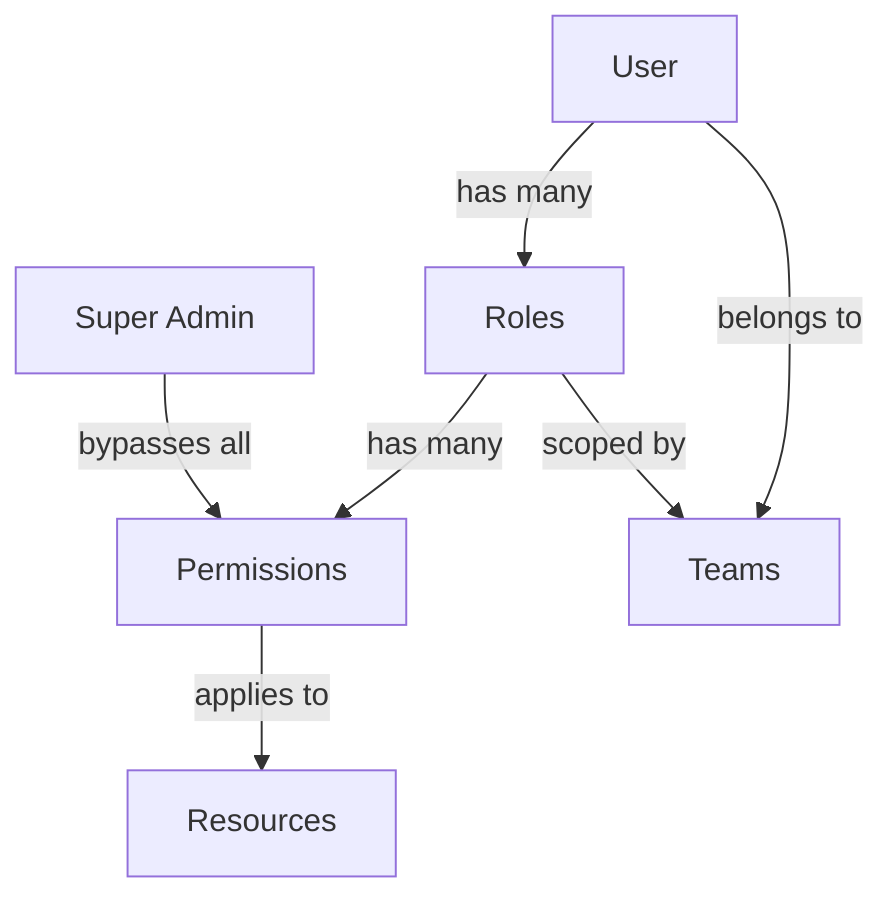

# Roles & Permissions

> 📹 **Video Placeholder**: Complete guide to Aura CMS role-based access control including creating roles, assigning permissions, and implementing custom authorization logic

Aura CMS provides a sophisticated role-based access control (RBAC) system that seamlessly integrates with teams, resources, and custom authorization logic. The system is designed to be both powerful and intuitive, supporting everything from simple role assignments to complex, team-scoped permissions.

## Table of Contents

- [Introduction](#introduction)
- [Core Concepts](#core-concepts)
- [Roles Management](#roles-management)
  - [Creating Roles](#creating-roles)
  - [Role Properties](#role-properties)
  - [Built-in Roles](#built-in-roles)
- [Permissions System](#permissions-system)
  - [Permission Structure](#permission-structure)
  - [Resource Permissions](#resource-permissions)
  - [Custom Permissions](#custom-permissions)
- [Authorization](#authorization)
  - [Gates & Policies](#gates--policies)
  - [Checking Permissions](#checking-permissions)
  - [Scoped Resources](#scoped-resources)
- [Super Admin & Global Admin](#super-admin--global-admin)
- [Team-Based Permissions](#team-based-permissions)
- [Advanced Usage](#advanced-usage)
- [Best Practices](#best-practices)
- [Troubleshooting](#troubleshooting)

## Introduction

The RBAC system in Aura CMS is built on Laravel's authorization foundation, enhanced with:

- **Resource-based permissions**: Automatic permission generation for all resources
- **Team scoping**: Permissions can be scoped to specific teams
- **Hierarchical roles**: Super Admin and Global Admin for system-wide access
- **Dynamic permissions**: Add custom permissions without database migrations
- **Policy integration**: Seamless integration with Laravel policies
- **UI components**: Built-in field types for permission management

## Core Concepts

### Permission Model



### Key Components

| Component | Description | Example |
|-----------|-------------|---------|
| **Role** | Named set of permissions | Editor, Manager, Admin |
| **Permission** | Ability to perform action | create-posts, delete-users |
| **Resource** | Entity being protected | Post, User, Product |
| **Scope** | Permission context | Team, Global, Personal |
| **Policy** | Authorization logic | ResourcePolicy, TeamPolicy |

## Roles Management

### Creating Roles

Roles can be created through the UI or programmatically:

#### Via Admin Interface

1. Navigate to **Settings > Roles**
2. Click **Create Role**
3. Configure role properties and permissions
4. Save the role

#### Programmatically

```php
use Aura\Base\Resources\Role;

// Basic role creation
$role = Role::create([
    'name' => 'Content Editor',
    'slug' => 'content-editor',
    'description' => 'Can manage all content types',
    'super_admin' => false,
    'permissions' => [
        'viewAny-post' => true,
        'view-post' => true,
        'create-post' => true,
        'update-post' => true,
        'delete-post' => false,
    ],
]);

// Team-scoped role
if (config('aura.teams')) {
    $role = Role::create([
        'name' => 'Team Manager',
        'slug' => 'team-manager',
        'team_id' => $team->id,
        'permissions' => [
            'manage-team-members' => true,
            'manage-team-settings' => true,
        ],
    ]);
}
```

### Role Properties

The Role resource is stored in a dedicated `roles` table with the following properties:

| Property | Type | Description | Example |
|----------|------|-------------|---------|
| `name` | string | Display name | "Content Editor" |
| `slug` | string | Unique identifier (auto-generated from name) | "content-editor" |
| `description` | text | Role description (optional) | "Manages blog content" |
| `permissions` | json | Permission array with boolean values | `['create-post' => true]` |
| `super_admin` | boolean | Bypass all permission checks | `false` |
| `team_id` | integer | Team association (when teams enabled) | `1` |

**Note:** The `permissions` field is cast as an array and stores permission slugs as keys with boolean values. When `super_admin` is `true`, the permissions field is hidden in the UI since super admins bypass all checks.

### Built-in Roles

Aura CMS includes several pre-configured roles:

```php
// During installation
php artisan aura:install

// Creates default roles:
// - Super Admin (system-wide access)
// - Admin (team administration)
// - Member (basic access)
```

### Role Assignment

#### Single Role Assignment

```php
// Assign role to user
$user->roles()->attach($role->id);

// With team context
$user->roles()->attach($role->id, [
    'team_id' => $team->id,
]);

// Using the Roles field
$user->update([
    'roles' => [$role->id],
]);
```

#### Multiple Roles

```php
// Sync multiple roles (replaces existing)
$user->roles()->sync([
    $adminRole->id => ['team_id' => $team1->id],
    $editorRole->id => ['team_id' => $team2->id],
]);

// Add without removing existing
$user->roles()->syncWithoutDetaching($roleIds);
```

#### Role Removal

```php
// Remove specific role
$user->roles()->detach($roleId);

// Remove all roles
$user->roles()->detach();

// Remove team-specific role
$user->roles()
    ->wherePivot('team_id', $teamId)
    ->detach($roleId);
```

## Permissions System

### Permission Structure

Permissions are stored in the `permissions` table and follow a consistent naming convention:

```
{action}-{resource-slug}
```

Examples:
- `create-post`
- `viewAny-user`
- `delete-product`
- `scope-article`

#### Permission Fields

| Field | Type | Description | Example |
|-------|------|-------------|---------|
| `name` | string | Human-readable name | "Create Posts" |
| `slug` | string | Unique identifier | "create-post" |
| `description` | text | Optional description | "Allows creating new posts" |
| `group` | string | Grouping for UI display | "Posts" |
| `team_id` | integer | Team association (when teams enabled) | `1` |

### Resource Permissions

Each resource automatically gets these permissions:

| Permission | Description | Policy Method |
|------------|-------------|---------------|
| `viewAny-{resource}` | List all resources | `viewAny()` |
| `view-{resource}` | View single resource | `view()` |
| `create-{resource}` | Create new resource | `create()` |
| `update-{resource}` | Edit existing resource | `update()` |
| `delete-{resource}` | Soft delete resource | `delete()` |
| `restore-{resource}` | Restore deleted resource | `restore()` |
| `forceDelete-{resource}` | Permanently delete | `forceDelete()` |
| `scope-{resource}` | Limit to own resources | N/A |

### Custom Permissions

#### Adding Custom Permissions

Custom permissions can be added by creating Permission records directly. Roles store permissions as a JSON array, so you can include any permission slug in your role definitions:

```php
use Aura\Base\Resources\Permission;

// Create custom permissions in the database
Permission::create([
    'name' => 'Publish Articles',
    'slug' => 'publish-article',
    'group' => 'Articles',
]);

Permission::create([
    'name' => 'Feature Articles',
    'slug' => 'feature-article',
    'group' => 'Articles',
]);

// In role creation, include both standard and custom permissions
$editorRole = Role::create([
    'name' => 'Editor',
    'slug' => 'editor',
    'permissions' => [
        // Standard permissions (auto-generated)
        'create-article' => true,
        'update-article' => true,
        
        // Custom permissions
        'publish-article' => true,
        'feature-article' => false,
    ],
]);
```

#### Checking Permissions

The User model provides two methods for checking permissions:

**`hasPermission($permission)`** - Check by permission slug string:

```php
// Check a specific permission by its slug
if ($user->hasPermission('publish-article')) {
    $article->publish();
}

// In Blade views
@if(auth()->user()->hasPermission('feature-article'))
    <button>Feature on Homepage</button>
@endif
```

**`hasPermissionTo($ability, $resource)`** - Check resource-based permission:

```php
// Check permission for a resource (used by policies)
if ($user->hasPermissionTo('create', Post::class)) {
    // Can create posts
}

if ($user->hasPermissionTo('update', $post)) {
    // Can update this specific post
}
```

**How permission checking works:**

```php
// From User resource - both methods iterate through user's roles
public function hasPermission($permission)
{
    $roles = $this->cachedRoles();

    foreach ($roles as $role) {
        // Super admin bypasses all checks
        if ($role->super_admin) {
            return true;
        }

        $permissions = $role->fields['permissions'];
        
        foreach ($permissions as $p => $value) {
            if ($p == $permission && $value == true) {
                return true;
            }
        }
    }

    return false;
}
```

**Role-based checks:**

```php
// Check if user has a specific role
if ($user->hasRole('editor')) {
    // User has the editor role
}

// Check if user has any of the given roles
if ($user->hasAnyRole(['editor', 'admin', 'moderator'])) {
    // User has at least one of these roles
}
```

### Permission Generation

#### Automatic Generation

```bash
# Generate permissions for all resources
php artisan aura:create-resource-permissions
```

#### Via Role Action

In the Roles resource, there's a built-in action called "Create Missing Permissions" that generates all missing permissions for registered resources.

#### Programmatic Generation

```php
use Aura\Base\Jobs\GenerateResourcePermissions;
use Aura\Base\Jobs\GenerateAllResourcePermissions;

// Generate permissions for a single resource
GenerateResourcePermissions::dispatch(Article::class);

// Generate permissions for ALL registered resources
GenerateAllResourcePermissions::dispatch();
```

The generated permissions for each resource include:
- `view-{slug}` - View single resource
- `viewAny-{slug}` - List all resources
- `create-{slug}` - Create new resource
- `update-{slug}` - Edit existing resource
- `restore-{slug}` - Restore deleted resource
- `delete-{slug}` - Soft delete resource
- `forceDelete-{slug}` - Permanently delete
- `scope-{slug}` - Limit to own resources

## Authorization

### Gates & Policies

Aura CMS uses Laravel's authorization system with enhanced resource policies:

#### Resource Policy

The `ResourcePolicy` handles authorization for all resources. Here's the actual implementation pattern:

```php
namespace Aura\Base\Policies;

use Illuminate\Auth\Access\HandlesAuthorization;

class ResourcePolicy
{
    use HandlesAuthorization;

    public function viewAny($user, $resource)
    {
        // Check if index view is disabled at resource level
        if ($resource::$indexViewEnabled === false) {
            return false;
        }

        // Super admin bypass
        if ($user->isSuperAdmin()) {
            return true;
        }

        // Check permission
        if ($user->hasPermissionTo('viewAny', $resource)) {
            return true;
        }

        return false;
    }

    public function view($user, $resource)
    {
        // Check config-level setting
        if (config('aura.resource-view-enabled') === false) {
            return false;
        }

        // Check resource-level setting
        if ($resource::$viewEnabled === false) {
            return false;
        }

        if ($user->isSuperAdmin()) {
            return true;
        }

        // Scoped: user can only view their own resources
        if ($user->hasPermissionTo('scope', $resource) && 
            $user->hasPermissionTo('view', $resource)) {
            return $resource->user_id == $user->id;
        }

        return $user->hasPermissionTo('view', $resource);
    }

    public function update($user, $resource)
    {
        if ($resource::$editEnabled === false) {
            return false;
        }

        if ($user->isSuperAdmin()) {
            return true;
        }

        // Scoped: user can only update their own resources
        if ($user->hasPermissionTo('scope', $resource) && 
            $user->hasPermissionTo('update', $resource)) {
            return $resource->user_id == $user->id;
        }

        return $user->hasPermissionTo('update', $resource);
    }
}
```

**Key Policy Methods:**
- `viewAny` - Checks `$indexViewEnabled` static property
- `view` - Checks both config and `$viewEnabled` static property  
- `create` - Checks `$createEnabled` static property
- `update` - Checks `$editEnabled` static property
- `delete`, `restore`, `forceDelete` - Standard permission checks with scope support

#### Custom Gates

```php
// In AuthServiceProvider
public function boot()
{
    // Global admin gate
    Gate::define('AuraGlobalAdmin', function (User $user) {
        return in_array($user->email, config('aura.global_admins', []));
    });
    
    // Feature gates
    Gate::define('access-analytics', function (User $user) {
        return $user->hasPermission('view-analytics') || 
               $user->hasRole('analyst');
    });
    
    // Resource gates
    Gate::define('publish', function (User $user, $resource) {
        return $user->hasPermission("publish-{$resource->getType()}");
    });
}
```

### Checking Permissions

#### In Controllers

```php
class ArticleController extends Controller
{
    public function store(Request $request)
    {
        // Using authorize method
        $this->authorize('create', Article::class);
        
        // Manual check
        if (!auth()->user()->can('create', Article::class)) {
            abort(403);
        }
        
        // Using Gate
        if (Gate::denies('create-article')) {
            abort(403);
        }
    }
    
    public function publish(Article $article)
    {
        // Custom authorization
        $this->authorize('publish', $article);
        
        $article->publish();
    }
}
```

#### In Blade Views

```blade
{{-- Standard checks --}}
@can('create', App\Resources\Article::class)
    <a href="{{ route('articles.create') }}">New Article</a>
@endcan

@can('update', $article)
    <a href="{{ route('articles.edit', $article) }}">Edit</a>
@endcan

{{-- Using permissions directly --}}
@if(auth()->user()->hasPermission('publish-article'))
    <button>Publish</button>
@endif

{{-- Check role instead of multiple permissions --}}
@if(auth()->user()->hasAnyRole(['editor', 'admin']))
    <div class="actions">...</div>
@endif
```

#### In Livewire Components

```php
class ArticleForm extends Component
{
    public function mount($article = null)
    {
        if ($article) {
            $this->authorize('update', $article);
        } else {
            $this->authorize('create', Article::class);
        }
    }
    
    public function save()
    {
        // Re-check permission
        if ($this->article->exists) {
            $this->authorize('update', $this->article);
        }
        
        $this->article->save();
    }
}
```

### Scoped Resources

The `scope` permission limits users to only see and manage their **own** resources (where `user_id` matches the authenticated user).

#### How Scoping Works

Aura CMS automatically applies the `ScopedScope` global scope to all resources. When a user has the `scope-{resource}` permission, queries are automatically filtered:

```php
// From src/Models/Scopes/ScopedScope.php
class ScopedScope implements Scope
{
    public function apply(Builder $builder, Model $model)
    {
        // Super admins see everything
        if (auth()->user()->isSuperAdmin()) {
            return $builder;
        }

        // If user has scope permission, filter by user_id
        if (auth()->user()->hasPermissionTo('scope', $model)) {
            $builder->where($model->getTable().'.user_id', auth()->user()->id);
        }

        return $builder;
    }
}
```

#### Setting Up Scoped Permissions

```php
use Aura\Base\Resources\Role;

// Create a role with scoped access
$authorRole = Role::create([
    'name' => 'Author',
    'slug' => 'author',
    'permissions' => [
        'viewAny-post' => true,  // Can access post list
        'view-post' => true,      // Can view posts
        'create-post' => true,    // Can create posts
        'update-post' => true,    // Can update posts
        'delete-post' => true,    // Can delete posts
        'scope-post' => true,     // KEY: Only see/edit OWN posts
    ],
]);
```

#### Scoping in Policies

The `ResourcePolicy` also respects scope permissions for individual actions:

```php
// From ResourcePolicy - update method
public function update($user, $resource)
{
    if ($user->isSuperAdmin()) {
        return true;
    }

    // Scoped: check if user owns the resource
    if ($user->hasPermissionTo('scope', $resource) && 
        $user->hasPermissionTo('update', $resource)) {
        // Can only update if user_id matches
        return $resource->user_id == $user->id;
    }

    return $user->hasPermissionTo('update', $resource);
}
```

#### Example Behavior

| User Role | Has `scope-post` | Query Result |
|-----------|------------------|--------------|
| Super Admin | N/A | Sees ALL posts |
| Editor | `false` | Sees ALL posts |
| Author | `true` | Sees ONLY own posts |

**Note:** Resources must have a `user_id` column for scoping to work. The `ScopedScope` skips Role and User resources to prevent recursion issues.

## Super Admin & Global Admin

Aura CMS has two distinct concepts for elevated privileges: **Super Admin** (role-based) and **Global Admin** (gate-based).

### Super Admin Role

Super Admin is a `super_admin` flag on the Role model that bypasses **all** permission checks:

```php
use Aura\Base\Resources\Role;

// Create super admin role
$superAdmin = Role::create([
    'name' => 'Super Admin',
    'slug' => 'super-admin',
    'super_admin' => true,
    'permissions' => [], // Permissions are ignored when super_admin is true
]);

// Assign to user
$user->roles()->attach($superAdmin->id);

// Check if user has any super admin role
if ($user->isSuperAdmin()) {
    // User has unlimited access - all permission checks return true
}
```

**How `isSuperAdmin()` works:**

```php
// From User resource (src/Resources/User.php)
public function isSuperAdmin(): bool
{
    $roles = $this->cachedRoles();

    if (!$roles) {
        return false;
    }

    foreach ($roles as $role) {
        if ($role->super_admin) {
            return true;
        }
    }

    return false;
}
```

#### Super Admin Capabilities

- Bypass **all** permission checks in policies
- Access all resources regardless of `scope` permission
- Not affected by `ScopedScope` query restrictions
- Perform any action in the system
- See all resources across all scopes

### Global Admin (Aura Admin)

Global Admin is defined via a Laravel Gate called `AuraGlobalAdmin`. This is for system-level administration that goes beyond normal permissions:

```php
// Define in your AppServiceProvider boot() method
use Illuminate\Support\Facades\Gate;

Gate::define('AuraGlobalAdmin', function ($user) {
    // Option 1: By email whitelist
    return in_array($user->email, [
        'admin@example.com',
        'superadmin@example.com',
    ]);
    
    // Option 2: By role
    return $user->hasRole('global-admin');
    
    // Option 3: By super admin status
    return $user->isSuperAdmin();
    
    // Option 4: Custom logic
    return $user->id === 1;
});
```

**Check Global Admin status:**

```php
// The User model provides this method
if ($user->isAuraGlobalAdmin()) {
    // User can access global admin features
}

// Implementation uses Gate::allows()
public function isAuraGlobalAdmin(): bool
{
    return Gate::allows('AuraGlobalAdmin');
}
```

#### Global Admin Capabilities

- **Impersonate** any user (except other Global Admins)
- Access system-wide settings
- Manage resources in **all teams** (cross-team access)
- Perform admin actions not tied to specific permissions

### Comparison

| Feature | Super Admin | Global Admin |
|---------|-------------|--------------|
| Bypass all permissions | ✓ | ✗ |
| Bypass scope restrictions | ✓ | ✗ |
| Impersonate users | Requires Global Admin | ✓ |
| Access all teams | ✓ | ✓ |
| Defined by | `super_admin` flag on Role | `AuraGlobalAdmin` Gate |
| Checked via | `$user->isSuperAdmin()` | `$user->isAuraGlobalAdmin()` |

**Typical Setup:** Most installations make Super Admins also Global Admins:

```php
Gate::define('AuraGlobalAdmin', function ($user) {
    return $user->isSuperAdmin();
});
```

## Team-Based Permissions

When teams are enabled, permissions become team-aware:

### Team Role Assignment

```php
// Assign role for specific team
$user->roles()->attach($editorRole->id, [
    'team_id' => $team->id,
]);

// User can have different roles in different teams
$user->roles()->attach([
    $adminRole->id => ['team_id' => $team1->id],
    $memberRole->id => ['team_id' => $team2->id],
]);
```

### Team Permission Checks

```php
// Check permission in current team context
if ($user->hasPermissionTo('create', Post::class)) {
    // Checks permission for current team
}

// Check permission for specific team
$user->switchTeam($team);
if ($user->hasPermissionTo('manage', Project::class)) {
    // Can manage projects in this team
}

// Get roles for current team
$teamRoles = $user->roles()
    ->wherePivot('team_id', $user->current_team_id)
    ->get();
```

### Team-Scoped Resources

```php
class Project extends Resource
{
    use BelongsToTeam;
    
    // Automatically scoped to team
    protected static function booted()
    {
        static::addGlobalScope(new TeamScope);
    }
}

// Queries automatically filtered by team
$projects = Project::all(); // Only current team's projects
```

### Cross-Team Permissions

```php
// Allow viewing resources from other teams
public function view($user, $project)
{
    // Own team
    if ($project->team_id === $user->current_team_id) {
        return $user->hasPermissionTo('view', $project);
    }
    
    // Other teams (read-only)
    if ($user->teams->contains($project->team_id)) {
        return true;
    }
    
    return false;
}
```

## Advanced Usage

### Dynamic Permission Registration

```php
// Register permissions at runtime
class PluginServiceProvider extends ServiceProvider
{
    public function boot()
    {
        // Add custom permissions to existing resources
        Article::macro('customPermissions', function() {
            return [
                'translate-article' => 'Translate articles',
                'schedule-article' => 'Schedule publishing',
            ];
        });
        
        // Register new resource with permissions
        Aura::resource(Newsletter::class);
        GenerateResourcePermissions::dispatch(Newsletter::class);
    }
}
```

### Permission Inheritance

```php
class Role extends Model
{
    public function getEffectivePermissions()
    {
        $permissions = collect($this->permissions);
        
        // Inherit from parent role
        if ($this->parent_role_id) {
            $parentPermissions = $this->parentRole->getEffectivePermissions();
            $permissions = $permissions->merge($parentPermissions);
        }
        
        return $permissions->unique()->filter();
    }
}
```

### Conditional Permissions

```php
class ArticlePolicy
{
    public function update(User $user, Article $article)
    {
        // Time-based permission
        if ($article->created_at->diffInHours() > 24) {
            return $user->hasPermission('update-old-articles');
        }
        
        // Status-based permission
        if ($article->status === 'published') {
            return $user->hasPermission('update-published-articles');
        }
        
        // Standard check
        return $user->hasPermissionTo('update', $article);
    }
}
```

### Permission Caching

```php
class User extends Authenticatable
{
    public function hasPermission($permission)
    {
        return Cache::remember(
            "user.{$this->id}.permission.{$permission}",
            3600,
            function () use ($permission) {
                return $this->calculateHasPermission($permission);
            }
        );
    }
    
    // Clear cache on role change
    public static function boot()
    {
        parent::boot();
        
        static::pivotAttached(function ($model, $relationName) {
            if ($relationName === 'roles') {
                Cache::forget("user.{$model->id}.permission.*");
            }
        });
    }
}
```

## Best Practices

### 1. Permission Naming

```php
// ✅ Good: Clear and consistent
'create-article'
'update-article'
'publish-article'
'manage-article-comments'

// ❌ Bad: Inconsistent or vague
'article_create'
'edit-articles'
'article-management'
'do-stuff'
```

### 2. Role Design

```php
// ✅ Good: Specific, meaningful roles
Role::create([
    'name' => 'Content Editor',
    'slug' => 'content-editor',
    'description' => 'Can create and edit articles, but not publish',
    'permissions' => [
        'create-article' => true,
        'update-article' => true,
        'delete-article' => false,
        'publish-article' => false,
    ],
]);

// ❌ Bad: Too broad or unclear
Role::create([
    'name' => 'User',
    'permissions' => ['*' => true],
]);
```

### 3. Security Checks

```php
// ✅ Good: Multiple layers of checks
public function delete(User $user, Article $article)
{
    // Check multiple conditions
    if ($user->isSuperAdmin()) {
        return true;
    }
    
    if (!$user->hasPermissionTo('delete', $article)) {
        return false;
    }
    
    if ($article->is_locked) {
        return false;
    }
    
    return true;
}

// ❌ Bad: Single point of failure
public function delete($user, $article)
{
    return $user->role === 'admin';
}
```

### 4. UI Integration

```blade
{{-- ✅ Good: Graceful permission handling --}}
<div class="actions">
    @can('update', $article)
        <a href="{{ route('articles.edit', $article) }}" class="btn">Edit</a>
    @endcan
    
    @can('delete', $article)
        <form method="POST" action="{{ route('articles.destroy', $article) }}">
            @csrf
            @method('DELETE')
            <button type="submit" class="btn-danger">Delete</button>
        </form>
    @else
        <span class="text-muted">No delete permission</span>
    @endcan
</div>

{{-- ❌ Bad: No permission checks --}}
<a href="{{ route('articles.edit', $article) }}">Edit</a>
<a href="{{ route('articles.delete', $article) }}">Delete</a>
```

## Troubleshooting

### Permission Not Working

```php
// Debug permission check
dd([
    'user' => auth()->id(),
    'roles' => auth()->user()->roles->pluck('slug'),
    'permissions' => auth()->user()->roles->pluck('permissions')->flatten(),
    'has_permission' => auth()->user()->hasPermission('create-article'),
    'is_super_admin' => auth()->user()->isSuperAdmin(),
]);
```

### Role Not Applying

```php
// Check role assignment
$user = User::find(1);

// Get all roles for the user
$roles = $user->roles;

// Get roles for current team (when teams enabled)
$teamRoles = $user->roles()
    ->wherePivot('team_id', $user->current_team_id)
    ->get();

// Check specific permission
$hasPermission = $user->hasPermission('create-post');

// Check if super admin
$isSuperAdmin = $user->isSuperAdmin();

dd([
    'roles' => $roles->pluck('slug'),
    'team_roles' => $teamRoles->pluck('slug'),
    'is_super_admin' => $isSuperAdmin,
    'has_permission' => $hasPermission,
]);
```

### Policy Not Called

Aura CMS uses `ResourcePolicy` for all resources by default. If you need a custom policy:

```php
// Option 1: Register in AuthServiceProvider
protected $policies = [
    \App\Aura\Resources\Article::class => \App\Policies\ArticlePolicy::class,
];

// Option 2: Create a policy that extends ResourcePolicy
namespace App\Policies;

use Aura\Base\Policies\ResourcePolicy;

class ArticlePolicy extends ResourcePolicy
{
    // Override specific methods as needed
    public function publish($user, $article)
    {
        if ($user->isSuperAdmin()) {
            return true;
        }
        
        return $user->hasPermission('publish-article');
    }
}
```

**Common issues:**
- Make sure the resource class matches what's registered in the policy
- Check that `ResourcePolicy` is being used (Aura registers it automatically)
- Verify the user is authenticated when making authorization checks

### Team Permission Issues

```php
// Verify team context
$user = auth()->user();

dd([
    'current_team_id' => $user->current_team_id,
    'current_team' => $user->currentTeam,
    'all_teams' => $user->teams->pluck('name', 'id'),
    'roles_for_current_team' => $user->roles()
        ->wherePivot('team_id', $user->current_team_id)
        ->get()
        ->pluck('slug'),
    'belongs_to_team' => $user->belongsToTeam($team),
]);
```

## Summary

Aura CMS's RBAC system provides:

- **Flexible role management** with team support
- **Granular permissions** down to individual actions
- **Policy integration** for complex authorization logic
- **Automatic permission generation** for resources
- **UI components** for easy permission management
- **Performance optimization** through caching

The system is designed to scale from simple role assignments to complex, multi-tenant applications with fine-grained access control.

> 📹 **Video Placeholder**: Advanced authorization patterns and custom permission systems in Aura CMS

For authentication setup, see the [Authentication Documentation](authentication.md).
