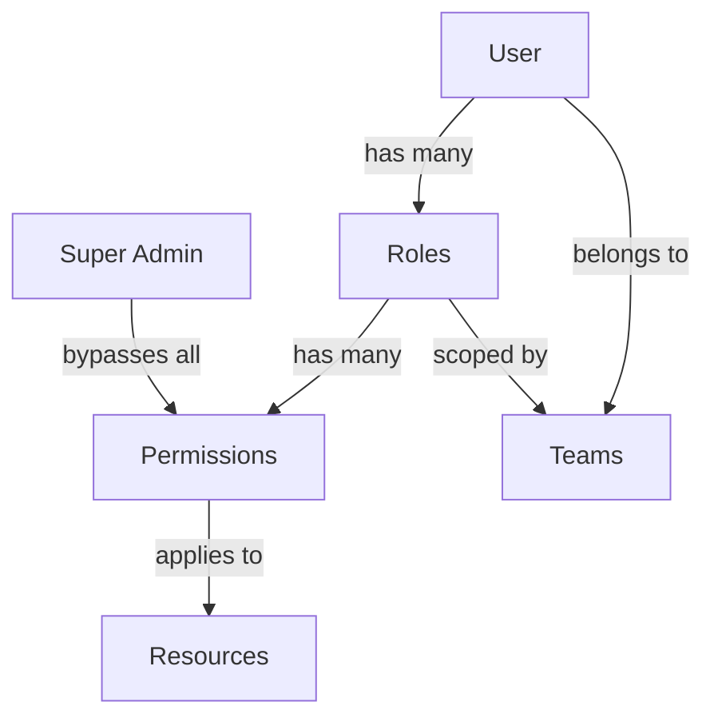

# Roles & Permissions

> 📹 **Video Placeholder**: Complete guide to Aura CMS role-based access control including creating roles, assigning permissions, and implementing custom authorization logic

Aura CMS provides a sophisticated role-based access control (RBAC) system that seamlessly integrates with teams, resources, and custom authorization logic. The system is designed to be both powerful and intuitive, supporting everything from simple role assignments to complex, team-scoped permissions.

## Table of Contents

- [Introduction](#introduction)
- [Core Concepts](#core-concepts)
- [Roles Management](#roles-management)
  - [Creating Roles](#creating-roles)
  - [Role Properties](#role-properties)
  - [Built-in Roles](#built-in-roles)
- [Permissions System](#permissions-system)
  - [Permission Structure](#permission-structure)
  - [Resource Permissions](#resource-permissions)
  - [Custom Permissions](#custom-permissions)
- [Authorization](#authorization)
  - [Gates & Policies](#gates--policies)
  - [Checking Permissions](#checking-permissions)
  - [Scoped Resources](#scoped-resources)
- [Super Admin & Global Admin](#super-admin--global-admin)
- [Team-Based Permissions](#team-based-permissions)
- [Advanced Usage](#advanced-usage)
- [Best Practices](#best-practices)
- [Troubleshooting](#troubleshooting)

## Introduction

The RBAC system in Aura CMS is built on Laravel's authorization foundation, enhanced with:

- **Resource-based permissions**: Automatic permission generation for all resources
- **Team scoping**: Permissions can be scoped to specific teams
- **Hierarchical roles**: Super Admin and Global Admin for system-wide access
- **Dynamic permissions**: Add custom permissions without database migrations
- **Policy integration**: Seamless integration with Laravel policies
- **UI components**: Built-in field types for permission management

## Core Concepts

### Permission Model



### Key Components

| Component | Description | Example |
|-----------|-------------|---------|
| **Role** | Named set of permissions | Editor, Manager, Admin |
| **Permission** | Ability to perform action | create-posts, delete-users |
| **Resource** | Entity being protected | Post, User, Product |
| **Scope** | Permission context | Team, Global, Personal |
| **Policy** | Authorization logic | ResourcePolicy, TeamPolicy |

## Roles Management

### Creating Roles

Roles can be created through the UI or programmatically:

#### Via Admin Interface

1. Navigate to **Settings > Roles**
2. Click **Create Role**
3. Configure role properties and permissions
4. Save the role

#### Programmatically

```php
use Aura\Base\Resources\Role;

// Basic role creation
$role = Role::create([
    'name' => 'Content Editor',
    'slug' => 'content-editor',
    'description' => 'Can manage all content types',
    'super_admin' => false,
    'permissions' => [
        'viewAny-post' => true,
        'view-post' => true,
        'create-post' => true,
        'update-post' => true,
        'delete-post' => false,
    ],
]);

// Team-scoped role
if (config('aura.teams')) {
    $role = Role::create([
        'name' => 'Team Manager',
        'slug' => 'team-manager',
        'team_id' => $team->id,
        'permissions' => [
            'manage-team-members' => true,
            'manage-team-settings' => true,
        ],
    ]);
}
```

### Role Properties

| Property | Type | Description | Example |
|----------|------|-------------|---------|
| `name` | string | Display name | "Content Editor" |
| `slug` | string | Unique identifier | "content-editor" |
| `description` | text | Role description | "Manages blog content" |
| `permissions` | json | Permission array | `['create-post' => true]` |
| `super_admin` | boolean | Bypass all checks | `false` |
| `team_id` | integer | Team association | `1` |
| `color` | string | UI color | "blue" |
| `icon` | string | Role icon | "edit" |

### Built-in Roles

Aura CMS includes several pre-configured roles:

```php
// During installation
php artisan aura:install

// Creates default roles:
// - Super Admin (system-wide access)
// - Admin (team administration)
// - Member (basic access)
```

### Role Assignment

#### Single Role Assignment

```php
// Assign role to user
$user->roles()->attach($role->id);

// With team context
$user->roles()->attach($role->id, [
    'team_id' => $team->id,
]);

// Using the Roles field
$user->update([
    'roles' => [$role->id],
]);
```

#### Multiple Roles

```php
// Sync multiple roles (replaces existing)
$user->roles()->sync([
    $adminRole->id => ['team_id' => $team1->id],
    $editorRole->id => ['team_id' => $team2->id],
]);

// Add without removing existing
$user->roles()->syncWithoutDetaching($roleIds);
```

#### Role Removal

```php
// Remove specific role
$user->roles()->detach($roleId);

// Remove all roles
$user->roles()->detach();

// Remove team-specific role
$user->roles()
    ->wherePivot('team_id', $teamId)
    ->detach($roleId);
```

## Permissions System

### Permission Structure

Permissions follow a consistent naming convention:

```
{action}-{resource}
```

Examples:
- `create-post`
- `viewAny-user`
- `delete-product`

### Resource Permissions

Each resource automatically gets these permissions:

| Permission | Description | Policy Method |
|------------|-------------|---------------|
| `viewAny-{resource}` | List all resources | `viewAny()` |
| `view-{resource}` | View single resource | `view()` |
| `create-{resource}` | Create new resource | `create()` |
| `update-{resource}` | Edit existing resource | `update()` |
| `delete-{resource}` | Soft delete resource | `delete()` |
| `restore-{resource}` | Restore deleted resource | `restore()` |
| `forceDelete-{resource}` | Permanently delete | `forceDelete()` |
| `scope-{resource}` | Limit to own resources | N/A |

### Custom Permissions

#### Adding Custom Permissions

```php
class Article extends Resource
{
    // Define custom permissions
    public static function customPermissions(): array
    {
        return [
            'publish-article' => 'Publish articles',
            'feature-article' => 'Feature articles on homepage',
            'moderate-article-comments' => 'Moderate article comments',
        ];
    }
}

// In role creation
$editorRole = Role::create([
    'name' => 'Editor',
    'permissions' => [
        // Standard permissions
        'create-article' => true,
        'update-article' => true,
        
        // Custom permissions
        'publish-article' => true,
        'feature-article' => false,
        'moderate-article-comments' => true,
    ],
]);
```

#### Checking Custom Permissions

```php
// In controllers
if ($user->hasPermission('publish-article')) {
    $article->publish();
}

// In Blade views
@if(auth()->user()->hasPermission('feature-article'))
    <button>Feature on Homepage</button>
@endif

// In policies
public function publish(User $user, Article $article)
{
    return $user->hasPermission('publish-article') || 
           $user->id === $article->user_id;
}
```

### Permission Generation

#### Automatic Generation

```bash
# Generate permissions for all resources
php artisan aura:generate-permissions

# Generate for specific resource
php artisan aura:generate-permissions --resource=Article
```

#### Manual Generation

```php
use Aura\Base\Jobs\GenerateResourcePermissions;

// Generate permissions for a resource
GenerateResourcePermissions::dispatch(Article::class);

// In service provider
public function boot()
{
    // Auto-generate on resource registration
    Aura::afterRegisteringResource(function ($resource) {
        GenerateResourcePermissions::dispatch($resource);
    });
}
```

## Authorization

### Gates & Policies

Aura CMS uses Laravel's authorization system with enhanced resource policies:

#### Resource Policy

```php
namespace Aura\Base\Policies;

class ResourcePolicy
{
    public function viewAny($user, $resource)
    {
        // Check if viewing is disabled
        if ($resource::$indexViewEnabled === false) {
            return false;
        }
        
        // Super admin bypass
        if ($user->isSuperAdmin()) {
            return true;
        }
        
        // Check permission
        return $user->hasPermissionTo('viewAny', $resource);
    }
    
    public function update($user, $resource)
    {
        // Check if editing is disabled
        if ($resource::$editEnabled === false) {
            return false;
        }
        
        // Super admin bypass
        if ($user->isSuperAdmin()) {
            return true;
        }
        
        // Scoped permission check
        if ($user->hasPermissionTo('scope', $resource) && 
            $user->hasPermissionTo('update', $resource)) {
            return $resource->user_id === $user->id;
        }
        
        // Standard permission check
        return $user->hasPermissionTo('update', $resource);
    }
}
```

#### Custom Gates

```php
// In AuthServiceProvider
public function boot()
{
    // Global admin gate
    Gate::define('AuraGlobalAdmin', function (User $user) {
        return in_array($user->email, config('aura.global_admins', []));
    });
    
    // Feature gates
    Gate::define('access-analytics', function (User $user) {
        return $user->hasPermission('view-analytics') || 
               $user->hasRole('analyst');
    });
    
    // Resource gates
    Gate::define('publish', function (User $user, $resource) {
        return $user->hasPermission("publish-{$resource->getType()}");
    });
}
```

### Checking Permissions

#### In Controllers

```php
class ArticleController extends Controller
{
    public function store(Request $request)
    {
        // Using authorize method
        $this->authorize('create', Article::class);
        
        // Manual check
        if (!auth()->user()->can('create', Article::class)) {
            abort(403);
        }
        
        // Using Gate
        if (Gate::denies('create-article')) {
            abort(403);
        }
    }
    
    public function publish(Article $article)
    {
        // Custom authorization
        $this->authorize('publish', $article);
        
        $article->publish();
    }
}
```

#### In Blade Views

```blade
{{-- Standard checks --}}
@can('create', App\Resources\Article::class)
    <a href="{{ route('articles.create') }}">New Article</a>
@endcan

@can('update', $article)
    <a href="{{ route('articles.edit', $article) }}">Edit</a>
@endcan

{{-- Using permissions directly --}}
@if(auth()->user()->hasPermission('publish-article'))
    <button>Publish</button>
@endif

{{-- Multiple permissions --}}
@if(auth()->user()->hasAnyPermission(['edit-article', 'delete-article']))
    <div class="actions">...</div>
@endif
```

#### In Livewire Components

```php
class ArticleForm extends Component
{
    public function mount($article = null)
    {
        if ($article) {
            $this->authorize('update', $article);
        } else {
            $this->authorize('create', Article::class);
        }
    }
    
    public function save()
    {
        // Re-check permission
        if ($this->article->exists) {
            $this->authorize('update', $this->article);
        }
        
        $this->article->save();
    }
}
```

### Scoped Resources

Limit users to their own resources:

```php
// Grant scoped permission
$role = Role::create([
    'name' => 'Author',
    'permissions' => [
        'viewAny-post' => true,
        'create-post' => true,
        'update-post' => true,
        'delete-post' => true,
        'scope-post' => true, // KEY: Limits to own posts
    ],
]);

// In queries
public function index()
{
    $query = Post::query();
    
    // Apply scope if user has scoped permission
    if (auth()->user()->hasPermission('scope-post') && 
        !auth()->user()->isSuperAdmin()) {
        $query->where('user_id', auth()->id());
    }
    
    return $query->paginate();
}
```

## Super Admin & Global Admin

### Super Admin Role

Super Admin is a role-level flag that bypasses all permission checks:

```php
// Create super admin role
$superAdmin = Role::create([
    'name' => 'Super Admin',
    'slug' => 'super-admin',
    'super_admin' => true,
    'permissions' => [], // Permissions ignored for super admin
]);

// Check if user is super admin
if ($user->isSuperAdmin()) {
    // User has unlimited access
}
```

#### Super Admin Capabilities

- Bypass all permission checks
- Access all resources regardless of scope
- Perform any action in the system
- Cannot be restricted by policies

### Global Admin (Aura Admin)

Global Admin is defined via Laravel Gates for system-wide administration:

```php
// Define in AppServiceProvider
Gate::define('AuraGlobalAdmin', function (User $user) {
    // Option 1: Email-based
    return in_array($user->email, [
        'admin@example.com',
        'superadmin@example.com',
    ]);
    
    // Option 2: Role-based
    return $user->hasRole('global-admin');
    
    // Option 3: Custom logic
    return $user->id === 1 || $user->is_founder;
});

// Check if user is global admin
if ($user->isAuraGlobalAdmin()) {
    // User can manage system settings
}
```

#### Global Admin Capabilities

- Manage all teams (even if not a member)
- Create teams beyond limits
- Impersonate any user
- Access system settings
- View all resources across teams

### Comparison

| Feature | Super Admin | Global Admin |
|---------|-------------|---------------|
| Bypass permissions | ✓ | ✗ |
| Manage all teams | ✓ | ✓ |
| System settings | ✓ | ✓ |
| Defined by | Role flag | Gate |
| Team-scoped | ✗ | ✗ |

## Team-Based Permissions

When teams are enabled, permissions become team-aware:

### Team Role Assignment

```php
// Assign role for specific team
$user->roles()->attach($editorRole->id, [
    'team_id' => $team->id,
]);

// User can have different roles in different teams
$user->roles()->attach([
    $adminRole->id => ['team_id' => $team1->id],
    $memberRole->id => ['team_id' => $team2->id],
]);
```

### Team Permission Checks

```php
// Check permission in current team context
if ($user->hasPermissionTo('create', Post::class)) {
    // Checks permission for current team
}

// Check permission for specific team
$user->switchTeam($team);
if ($user->hasPermissionTo('manage', Project::class)) {
    // Can manage projects in this team
}

// Get roles for current team
$teamRoles = $user->roles()
    ->wherePivot('team_id', $user->current_team_id)
    ->get();
```

### Team-Scoped Resources

```php
class Project extends Resource
{
    use BelongsToTeam;
    
    // Automatically scoped to team
    protected static function booted()
    {
        static::addGlobalScope(new TeamScope);
    }
}

// Queries automatically filtered by team
$projects = Project::all(); // Only current team's projects
```

### Cross-Team Permissions

```php
// Allow viewing resources from other teams
public function view($user, $project)
{
    // Own team
    if ($project->team_id === $user->current_team_id) {
        return $user->hasPermissionTo('view', $project);
    }
    
    // Other teams (read-only)
    if ($user->teams->contains($project->team_id)) {
        return true;
    }
    
    return false;
}
```

## Advanced Usage

### Dynamic Permission Registration

```php
// Register permissions at runtime
class PluginServiceProvider extends ServiceProvider
{
    public function boot()
    {
        // Add custom permissions to existing resources
        Article::macro('customPermissions', function() {
            return [
                'translate-article' => 'Translate articles',
                'schedule-article' => 'Schedule publishing',
            ];
        });
        
        // Register new resource with permissions
        Aura::resource(Newsletter::class);
        GenerateResourcePermissions::dispatch(Newsletter::class);
    }
}
```

### Permission Inheritance

```php
class Role extends Model
{
    public function getEffectivePermissions()
    {
        $permissions = collect($this->permissions);
        
        // Inherit from parent role
        if ($this->parent_role_id) {
            $parentPermissions = $this->parentRole->getEffectivePermissions();
            $permissions = $permissions->merge($parentPermissions);
        }
        
        return $permissions->unique()->filter();
    }
}
```

### Conditional Permissions

```php
class ArticlePolicy
{
    public function update(User $user, Article $article)
    {
        // Time-based permission
        if ($article->created_at->diffInHours() > 24) {
            return $user->hasPermission('update-old-articles');
        }
        
        // Status-based permission
        if ($article->status === 'published') {
            return $user->hasPermission('update-published-articles');
        }
        
        // Standard check
        return $user->hasPermissionTo('update', $article);
    }
}
```

### Permission Caching

```php
class User extends Authenticatable
{
    public function hasPermission($permission)
    {
        return Cache::remember(
            "user.{$this->id}.permission.{$permission}",
            3600,
            function () use ($permission) {
                return $this->calculateHasPermission($permission);
            }
        );
    }
    
    // Clear cache on role change
    public static function boot()
    {
        parent::boot();
        
        static::pivotAttached(function ($model, $relationName) {
            if ($relationName === 'roles') {
                Cache::forget("user.{$model->id}.permission.*");
            }
        });
    }
}
```

## Best Practices

### 1. Permission Naming

```php
// ✅ Good: Clear and consistent
'create-article'
'update-article'
'publish-article'
'manage-article-comments'

// ❌ Bad: Inconsistent or vague
'article_create'
'edit-articles'
'article-management'
'do-stuff'
```

### 2. Role Design

```php
// ✅ Good: Specific, meaningful roles
Role::create([
    'name' => 'Content Editor',
    'slug' => 'content-editor',
    'description' => 'Can create and edit articles, but not publish',
    'permissions' => [
        'create-article' => true,
        'update-article' => true,
        'delete-article' => false,
        'publish-article' => false,
    ],
]);

// ❌ Bad: Too broad or unclear
Role::create([
    'name' => 'User',
    'permissions' => ['*' => true],
]);
```

### 3. Security Checks

```php
// ✅ Good: Multiple layers of checks
public function delete(User $user, Article $article)
{
    // Check multiple conditions
    if ($user->isSuperAdmin()) {
        return true;
    }
    
    if (!$user->hasPermissionTo('delete', $article)) {
        return false;
    }
    
    if ($article->is_locked) {
        return false;
    }
    
    return true;
}

// ❌ Bad: Single point of failure
public function delete($user, $article)
{
    return $user->role === 'admin';
}
```

### 4. UI Integration

```blade
{{-- ✅ Good: Graceful permission handling --}}
<div class="actions">
    @can('update', $article)
        <a href="{{ route('articles.edit', $article) }}" class="btn">Edit</a>
    @endcan
    
    @can('delete', $article)
        <form method="POST" action="{{ route('articles.destroy', $article) }}">
            @csrf
            @method('DELETE')
            <button type="submit" class="btn-danger">Delete</button>
        </form>
    @else
        <span class="text-muted">No delete permission</span>
    @endcan
</div>

{{-- ❌ Bad: No permission checks --}}
<a href="{{ route('articles.edit', $article) }}">Edit</a>
<a href="{{ route('articles.delete', $article) }}">Delete</a>
```

## Troubleshooting

### Permission Not Working

```php
// Debug permission check
dd([
    'user' => auth()->id(),
    'roles' => auth()->user()->roles->pluck('slug'),
    'permissions' => auth()->user()->roles->pluck('permissions')->flatten(),
    'has_permission' => auth()->user()->hasPermission('create-article'),
    'is_super_admin' => auth()->user()->isSuperAdmin(),
]);
```

### Role Not Applying

```php
// Check role assignment
$user = User::find(1);
dd([
    'roles' => $user->roles,
    'team_roles' => $user->roles()->wherePivot('team_id', $user->current_team_id)->get(),
    'all_permissions' => $user->getAllPermissions(),
]);
```

### Policy Not Called

```php
// Ensure policy is registered
// In AuthServiceProvider
protected $policies = [
    Article::class => ArticlePolicy::class,
];

// Or use auto-discovery
public function boot()
{
    Gate::guessPolicyNamesUsing(function ($modelClass) {
        return 'App\\Policies\\' . class_basename($modelClass) . 'Policy';
    });
}
```

### Team Permission Issues

```php
// Verify team context
dd([
    'current_team' => auth()->user()->current_team_id,
    'team_roles' => auth()->user()->currentTeamRoles(),
    'belongs_to_team' => auth()->user()->belongsToTeam($team),
]);
```

## Summary

Aura CMS's RBAC system provides:

- **Flexible role management** with team support
- **Granular permissions** down to individual actions
- **Policy integration** for complex authorization logic
- **Automatic permission generation** for resources
- **UI components** for easy permission management
- **Performance optimization** through caching

The system is designed to scale from simple role assignments to complex, multi-tenant applications with fine-grained access control.

> 📹 **Video Placeholder**: Advanced authorization patterns and custom permission systems in Aura CMS

For authentication setup, see the [Authentication Documentation](authentication.md).
